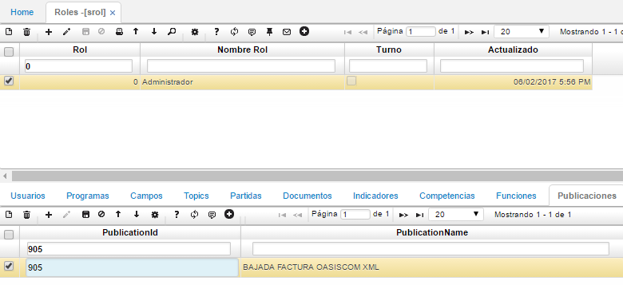
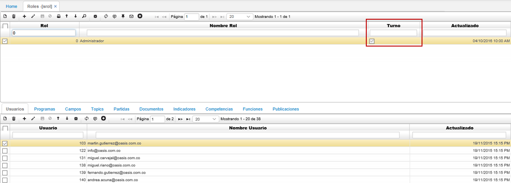

## Roles - SROL

### Parametrización XML

En la aplicación SROL se deben asignar los permisos correspondientes para visualizar la publicación parametrizada anteriormente en [**BPUB - Publicaciones**](http://docs.oasiscom.com/Operacion/utility/barchi/bpub), esto con el fin de posteriormente descargar el formato ya parametrizado o cargarlo al sistema en caso tal que el proceso que se esté realizando sea de operación _Upload_ Subir.  

Inicialmente, en el maestro se debe consultar el rol al que hace parte como usuario en el campo _Rol_. Una vez identificado el rol, se debe dirigir a la pestaña del detalle _Publicaciones_.

En esta pestaña del detalle, se debe agregar la publicación previamente parametrizada en la aplicación [**BPUB - Publicaciones**](http://docs.oasiscom.com/Operacion/utility/barchi/bpub). Agregamos un nuevo renglón y diligenciamos los campos.

**Publicación Id:** digitar el número de la publicación, si se desconoce, dar doble click y seleccionar del zoom la publicación correspondiente.  

**Nombre Publicación:** al ingresar el número de la publicación, el sistema arrojará el nombre automáticamente.  

Realizada esta parametrización se podrá proceder a realizar la carga o descarga del archivo desde la aplicación [**BINT - Interfaces**](http://docs.oasiscom.com/Operacion/utility/barchi/bint).  

## [Control de acceso a la aplicación por turnos](http://docs.oasiscom.com/Operacion/system/sacceso/srol#Control-de-acceso-a-la-aplicación-por-turnos)

Se validarán unos horarios en los que un usuario puede realizar sus actividades dentro del sistema.  

Para esto se debe tener las siguientes parametrizaciones:  

En la aplicación **SROL** se creó el campo _Turno_, el cual definirá si se controlará la validación de los turnos.  

Como se puede observar en la siguiente imagen, el campo _Turno_ está activo, esto nos indica que para los usuarios que tengan asociado este rol se les debe realizar la validación de los horarios para que pueda usar la aplicación.  

Activado el campo _Turno_ continuaremos con la parametrización en la aplicación [**NBTU - Turnos**](http://docs.oasiscom.com/Operacion/hrm/asistencia/nabasica/nbtu#Control-de-acceso-a-la-aplicación-por-turnos).

