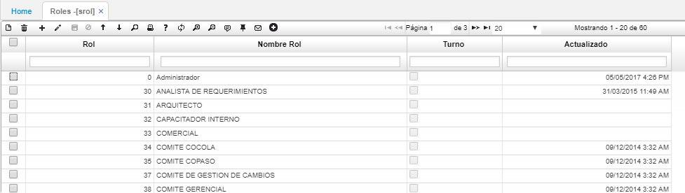
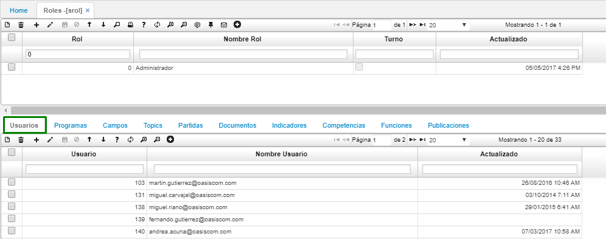
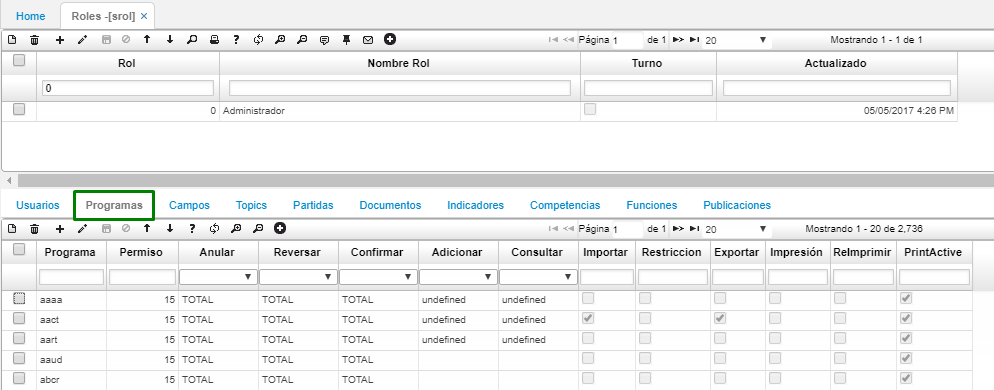
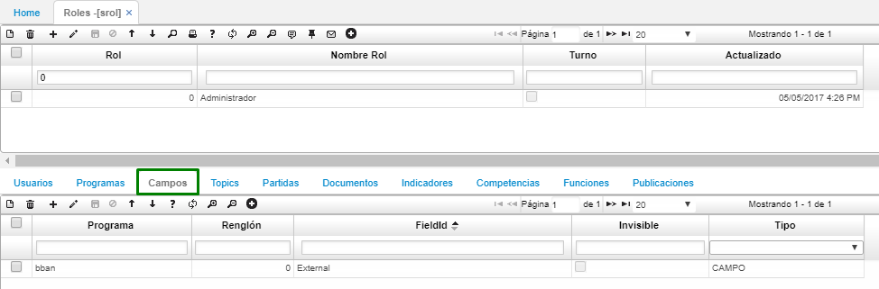
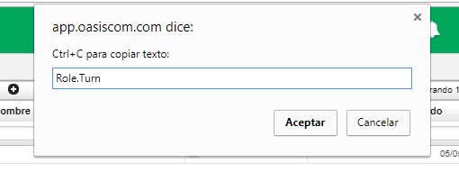
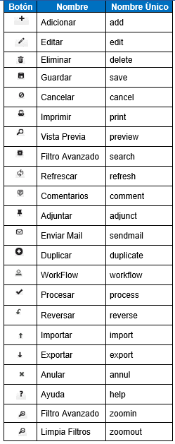
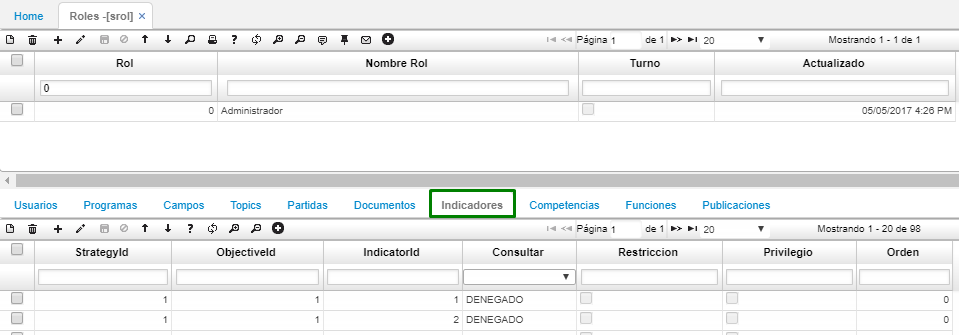
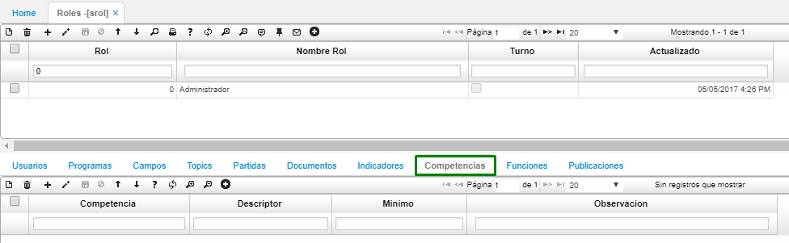
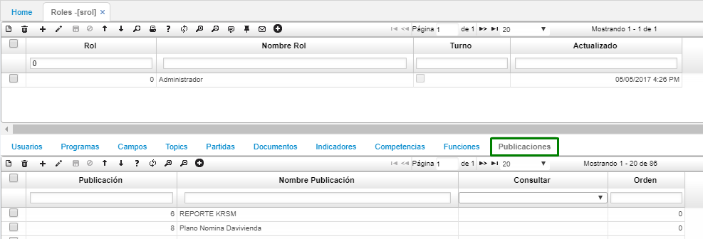

---

layout: default

title: Roles

permalink: /Operacion/system/sacceso/srol

editable: si

---

## Roles - SROL

En esta aplicación se definen los roles que harán parte de la seguridad y configuración del sistema, posteriormente a cada usuario se le asigna un rol el cual tiene asignadas ciertas aplicaciones y a estas se le asignan permisos para consultar, editar, eliminar, ocultar campos, ocultar iconos, entre otros.

En el maestro de esta aplicación se deben diligenciar los siguientes campos:

**Rol**: Id o número del rol. 
**Nombre Rol**: Nombre del rol. 
**Turno**: Activar el flag si ese rol se controlará por turnos y desactivarlo en caso que no. 
**Actualizado**: Campo automático que indica la fecha en la que se actualizó el registro. 

En la parte inferior denominada detalle al dar clic en algún rol registrado anteriormente se observan las pestañas de: Usuarios, Programas, Campos, Temas, Partidas, Documentos, Indicadores, Competencias, Funciones y publicaciones, en cada uno de ellos se encuentran unos campos para diligenciar los cuales se nombran a continuación:

###Pestaña Usuarios

En esta pestaña se permite visualizar todos los usuarios que están asociados al rol seleccionado en la parte superior (maestro).

**Usuario**: Número de usuario que tiene asignado el rol correspondiente.
**Nombre Usuario**: Correo del usuario con el cual se registró al sistema.
**Actualizado**: Campo automático que indica la fecha en la que se actualizó el registro.

###Pestaña Programas

En esta pestaña se permite visualizar todos los programas a los cuales tiene derecho el rol seleccionado en la parte superior (maestro). Aquí también se parametrizan los permisos para cada una de las aplicaciones.

**Programa**: Aplicaciones activas al rol correspondiente
**Permiso**: Tipo de permiso que se le otorgará a esa aplicación en ese rol. Si es acceso total es 15, si es acceso restringido es 8, estos números se determinan de acuerdo al modelo de número binarios.
**Anular**: Identifica que tipo de acceso se puede tener al anular un registro en esa aplicación. Las opciones son: Total, restringido o denegado.
**Reversar**: Identifica que tipo de acceso se puede tener al reversar un registro en esa aplicación. Las opciones son: Total, restringido o denegado.
**Confirmar**: Identifica que tipo de acceso se puede tener al confirmar un registro en esa aplicación. Las opciones son: Total, restringido o denegado.
**Adicionar**: Permite identificar si es posible adicionar registros en esa aplicación bajo el rol correspondiente. Las opciones son: Total, restringido o denegado.
**Consultar**: Permite identificar si es posible consultar un registro en esa aplicación. Las opciones son: Total, restringido, denegado, usuario (sólo permite consultar la información que ha registrado ese usuario), compañia (sólo permite consultar la información que ha registrado la compañia), ubicación (sólo permite consultar la información que esta asociada a la ubicación que tiene parametrizada el usuario). 
**Importar**: Permite identificar si es posible importar registros en esa aplicación bajo el rol correspondiente.
**Restricción**: Permite identificar si se tiene restricción sobre los documentos.
**Exportar**: Permite identificar si es posible exportar registros en esa aplicación bajo el rol correspondiente.
**Impresión**: Permite identificar si es posible imprimir registros en esa aplicación bajo el rol correspondiente.
**Reimprimir**: Permite identificar si es posible reimprimir (imprimir más de una vez el mismo documentos) registros en esa aplicación bajo el rol correspondiente.
**PrintActive**: Permite identificar si es posible imprimir registros en estado activo en esa aplicación bajo el rol correspondiente.

###Pestaña Campos

Esta pestaña permite ocultar algunos campos o botones del sistema al rol que se tiene seleccionado en la parte superior (maestro).

**Programa**: Aplicaciones a las cuales se les requiera ocultar algún campo o botón.
**Renglón**: Consecutivo de registros.
**Nombre del campo**: Nombre del campo o del botón con el cual se requiere realizar alguna acción. 

Para identificar el nombre del campo que se requiere ocultar se debe seleccionar el campo y oprimir shift + F11 y el nombre del campo es que se encuentra enseguida del punto (.), por ejemplo, para este caso que se muestra a continuación el nombre del campo es Turn.

Para identificar el nombre de los botones se debe tener en cuenta la siguiente lista:

**Invisible**: Se debe activar el flag si se requiere que el campo o botón este oculto, es decir, que cuando ingresemos a la aplicación no se pueda visualizar ese campo o botón para el usuario correspondiente.
**Tipo**: Existe una lista desplegable: Campo, Tab, botón parametrizado y botón fijo, dependiendo de la acción a realizar se selecciona el tipo para saber en dónde se realizará el efecto.

###Pestaña Indicadores

Esta pestaña permite que el rol seleccionado en la parte superior (maestro) pueda visualizar los indicadores y gráficas correspondientes a los mismos en la pantalla de inicio del sistema.

**Id Estrategia**: Id de la estrategia parametrizado previamente en la aplicación WIND.
**Id Objetivo**: Objetivo asociado a la estrategia, este se parametriza previamente en la aplicación WIND.
**Id Indicador**: Indicar asociado a la estrategia, este se parametriza previamente en la aplicación WIND.
**Consultar**: Permiso para visualizar los indicadores, se tienen 3 opciones: Total, restringido y denegado.
**Restricción**: Activar el flag si se requiere que ese indicador este restringido para los usuarios asociados a ese rol.
**Privilegio**: Activar el flag si se requiere que ese indicador tenga privilegios para los usuarios asociados a ese rol.
**Orden**: Indicar en que orden se requiere la visualización de los ejemplos, se debe iniciar desde 0 y finalizar hasta la cantidad de indicadores que se hayan parametrizado.

###Pestaña Competencias

Esta pestaña permite que el rol seleccionado en la parte superior (maestro) tenga asociadas competencias

**Competencias**: Id de la competencia 
**Descriptor**: Id del descriptor de la competencia asociada
**Mínimo**: Mínimo valor que se debe tener en esa competencia en una escala de 1 a 10
**Observación**: Observación requerida

###Pestaña Publicaciones

Esta pestaña permite asociar las publicaciones que se requieren que tenga esa usuario

**Publicaciones**: Id de la publicación que se requiere asociar a ese rol
**Nombre publicaciones**: Nombre de la publicación asociada al id de la misma
**Consultar**: Lista desplegable con las siguientes opciones total, restringido, denegado, usuario, compañia, ubicación.
**Orden**: Indicar en que orden se requiere la visualización de los ejemplos, se debe iniciar desde 0 y finalizar hasta la cantidad de indicadores que se hayan parametrizado.

### Parametrización XML

En la aplicación SROL se deben asignar los permisos correspondientes para visualizar la publicación parametrizada anteriormente en [**BPUB - Publicaciones**](http://docs.oasiscom.com/Operacion/utility/barchi/bpub), esto con el fin de posteriormente descargar el formato ya parametrizado o cargarlo al sistema en caso tal que el proceso que se esté realizando sea de operación _Upload_ Subir.  

Inicialmente, en el maestro se debe consultar el rol al que hace parte como usuario en el campo _Rol_. Una vez identificado el rol, se debe dirigir a la pestaña del detalle _Publicaciones_.

En esta pestaña del detalle, se debe agregar la publicación previamente parametrizada en la aplicación [**BPUB - Publicaciones**](http://docs.oasiscom.com/Operacion/utility/barchi/bpub). Agregamos un nuevo renglón y diligenciamos los campos.

**Publicación Id:** digitar el número de la publicación, si se desconoce, dar doble click y seleccionar del zoom la publicación correspondiente.  

**Nombre Publicación:** al ingresar el número de la publicación, el sistema arrojará el nombre automáticamente.  

Realizada esta parametrización se podrá proceder a realizar la carga o descarga del archivo desde la aplicación [**BINT - Interfaces**](http://docs.oasiscom.com/Operacion/utility/barchi/bint).  

## [Control de acceso a la aplicación por turnos](http://docs.oasiscom.com/Operacion/system/sacceso/srol#control-de-acceso-a-la-aplicacion-por-turnos)

Se validarán unos horarios en los que un usuario puede realizar sus actividades dentro del sistema.  

Para esto se debe tener las siguientes parametrizaciones:  

En la aplicación **SROL** se creó el campo _Turno_, el cual definirá si se controlará la validación de los turnos.  

Como se puede observar en la siguiente imagen, el campo _Turno_ está activo, esto nos indica que para los usuarios que tengan asociado este rol se les debe realizar la validación de los horarios para que pueda usar la aplicación.  

Activado el campo _Turno_ continuaremos con la parametrización en la aplicación [**NBTU - Turnos**](http://docs.oasiscom.com/Operacion/hrm/asistencia/nabasica/nbtu#Control-de-acceso-a-la-aplicación-por-turnos).

