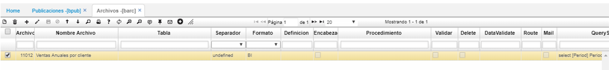
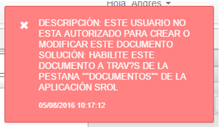

## Roles - SROL

En esta aplicación se definen los roles que harán parte de la seguridad y configuración del sistema, posteriormente a cada usuario se le asigna un rol el cual tiene asignadas ciertas aplicaciones y a estas se le asignan permisos para consultar, editar, eliminar, ocultar campos, ocultar iconos, entre otros.

En el maestro de esta aplicación se deben diligenciar los siguientes campos:

**Rol**: Id o número del rol.  
**Nombre Rol**: Nombre del rol.  
**Turno**: Activar el flag si ese rol se controlará por turnos y desactivarlo en caso que no.  
**Actualizado**: Campo automático que indica la fecha en la que se actualizó el registro.   

En la parte inferior denominada detalle al dar clic en algún rol registrado anteriormente se observan las pestañas de: Usuarios, Programas, Campos, Temas, Partidas, Documentos, Indicadores, Competencias, Funciones y publicaciones, en cada uno de ellos se encuentran unos campos para diligenciar los cuales se nombran a continuación:

### [Pestaña Usuarios](http://docs.oasiscom.com/Operacion/system/sacceso/srol#pestaña-usuarios)

En esta pestaña se permite visualizar todos los usuarios que están asociados al rol seleccionado en la parte superior (maestro).

**Usuario**: Número de usuario que tiene asignado el rol correspondiente.  
**Nombre Usuario**: Correo del usuario con el cual se registró al sistema.  
**Actualizado**: Campo automático que indica la fecha en la que se actualizó el registro.  

### [Pestaña Programas](http://docs.oasiscom.com/Operacion/system/sacceso/srol#pestaña-programas)

En esta pestaña se permite visualizar todos los programas a los cuales tiene derecho el rol seleccionado en la parte superior (maestro). Aquí también se parametrizan los permisos para cada una de las aplicaciones.

**Programa**: Aplicaciones activas al rol correspondiente.  
**Permiso**: Tipo de permiso que se le otorgará a esa aplicación en ese rol. Si es acceso total es 15, si es acceso restringido es 8, estos números se determinan de acuerdo al modelo de número binarios.  
**Anular**: Identifica que tipo de acceso se puede tener al anular un registro en esa aplicación. Las opciones son: Total, restringido o denegado.  
**Reversar**: Identifica que tipo de acceso se puede tener al reversar un registro en esa aplicación. Las opciones son: Total, restringido o denegado.  
**Confirmar**: Identifica que tipo de acceso se puede tener al confirmar un registro en esa aplicación. Las opciones son: Total, restringido o denegado.  
**Adicionar**: Permite identificar si es posible adicionar registros en esa aplicación bajo el rol correspondiente. Las opciones son: Total, restringido o denegado.  
**Consultar**: Permite identificar si es posible consultar un registro en esa aplicación. Las opciones son: Total, restringido, denegado, usuario (sólo permite consultar la información que ha registrado ese usuario), compañia (sólo permite consultar la información que ha registrado la compañia), ubicación (sólo permite consultar la información que esta asociada a la ubicación que tiene parametrizada el usuario).  
**Importar**: Permite identificar si es posible importar registros en esa aplicación bajo el rol correspondiente.  
**Restricción**: Permite identificar si se tiene restricción sobre los documentos.  
**Exportar**: Permite identificar si es posible exportar registros en esa aplicación bajo el rol correspondiente.  
**Impresión**: Permite identificar si es posible imprimir registros en esa aplicación bajo el rol correspondiente.  
**Reimprimir**: Permite identificar si es posible reimprimir (imprimir más de una vez el mismo documentos) registros en esa aplicación bajo el rol correspondiente.  
**PrintActive**: Permite identificar si es posible imprimir registros en estado activo en esa aplicación bajo el rol correspondiente.  

#### [Restricción de operaciones](http://docs.oasiscom.com/Operacion/system/sacceso/srol#restricción-de-operaciones)

Esta funcionalidad permitirá al usuario restringir la anulación, reversión, confirmación, adición y consulta de transacciones de las aplicaciones **tipo C** (por ejemplo: JFAC - Facturas, IMOV - Movimientos de inventarios), es decir, las conformadas por un maestro y un detalle, esto cuando se escoge la opción **RESTRINGIDO** en la pestaña _Programas_ de la opción SROL. Tener en cuenta que este valor en las transacciones de movimientos sólo aplica para las ubicaciones parametrizadas por el usuario en El Tab _Ubicaciones_ de la opción SUSU - Usuarios.  

#### [Restricción de consultas](http://docs.oasiscom.com/Operacion/system/sacceso/srol#restricción-de-consultas)

Esta funcionalidad permitirá al usuario restringir la consulta de aplicaciones **tipo A** (por ejemplo: IFDI - Diferencias, IMCM - Consulta de movimientos, KMCM - Consulta de movimientos) y aplicaciones **tipo B** (por ejemplo: ICKU - Kardex por ubicación, FPSA - Saldos y precios por ubicación) cuando se elige la opción **UBICACIÓN** del campo Consulta del Tab de _Programas_ de la opción SROL. Se debe tener en cuenta que este parámetro en las aplicaciones de consulta solo aplica para las ubicaciones permitidas por el usuario en el Tab _Ubicaciones_ de la opción SUSU - Usuarios.  

#### [Restricción de consultas aplicaciones tipo TABLERO y PIVOTE](http://docs.oasiscom.com/Operacion/system/sacceso/srol#restricción-de-consultas-aplicaciones-tipo-tablero-y-pivote)

Esta funcionalidad permite realizar restricción de consultas para las opciones de tipo _tablero_ y _pivote_ (BIVEN, BIVET, BISER), ya sea por usuario, compañía y/o ubicación, dependiendo de la parametrización realizada en la pestaña de _Publicaciones_ de la opción **SROL - Roles**.  

Para realizar una restricción de consulta para las opciones BI, en primera instancia, se debe parametrizar el archivo de la opción [**BARC - Archivos**](http://docs.oasiscom.com/Operacion/utility/barchi/barc), parametrizando la consulta para realizar la restricción correspondiente.  

En el campo _Query Sql_ se debe parametrizar la consulta dependiendo de tipo de restricción a realizar.  

 * Si se desea realizar restricción por Compañía, en la sentencia se deberá colocar el campo _CompanyId_ y tomará el dato parametrizado en el campo _OrganizationId_ de la opción **SUSU - Usuarios**.  

 * Si se desea realizar restricción por Usuario, en la sentencia se deberá colocar el campo _ClientId_ y tomará el dato parametrizado en el campo _Tercero_ de la opción **SUSU - Usuarios**.  

 * Si desea realizar restricción por ubicación, en la sentencia se deberá colocar el campo _LocationId_ y tomará las ubicaciones parametrizadas en la pestaña _Ubicaciones_ de la opción **SUSU - Usuarios**.  

Una vez adecuada la sentencia, en la pestaña _**Programas**_ de la opción SROL, se deberá seleccionar del campo _Consultar_ la opción correspondiente. En este caso, por ejemplo, se seleccionará consulta por **USUARIO**.  

Se debe iniciar sesión nuevamente en la aplicación para que se vean reflejados los cambios.  

Una vez iniciada la sesión en la aplicación, abrimos la opción **BIVEN - Ventas** (Previamente parametrizada en la opción SROL) y se selecciona la opción parametrizada en la opción **BARC - Archivos**:  

Al cargar los datos, puede observar que solamente muestra información correspondiente al usuario parametrizado en la opción **SUSU - Usuarios**:  

#### [Restricción de consultas por usuario conectado](http://docs.oasiscom.com/Operacion/system/sacceso/srol#restricción-de-consultas-por-usuario-conectado)

Es posible por medio de parametrización que los roles de los usuarios solo permitan consultar la información que se generó a nombre de ellos ya sea como clientes, vendedores o responsables.  

En la pestaña _Programas_ de la opción **SROL - Roles**, en el campo _Consultar_ se puede seleccionar el tipo de consulta a realizar de acuerdo a las siguientes opciones:  

De acuerdo a la opción seleccionada se mostrará la información correspondiente. Por ejemplo, parametrizando la opción _JFAC - Facturas_.  

Al consultar la información, se mostrará lo siguiente, lo que corresponde a una consulta por usuario:  

Si se cambia nuevamente la parametrización en el SROL, debe mostrar información consistente de acuerdo a lo seleccionado en el campo _CONSULTAR_:  

#### [Restricción de documentos por ubicación](http://docs.oasiscom.com/Operacion/system/sacceso/srol#restricción-de-documentos-por-ubicación)

El sistema permite bloquear o habilitar documentos, ubicaciones y conceptos dentro de las opciones **tipo C** (por ejemplo: JFAC - Facturas, IMOV - Movimientos de inventarios) dependiendo del rol del usuario.  

Para crear esta parametrización hay que acceder a la opción **SROL - Roles** y en la pestaña _Documentos_ crear los registros necesarios. Si para un rol no existe parametrización no se generarán restricciones al momento de consultar o crear algún movimiento.  

Para bloquear solo un concepto de un documento en específico de una ubicación específica, el registro se deberá crear de la siguiente manera en la pestaña _Documentos_ del detalle de la opción SROL - Roles:  

Si vamos a la opción **JFAC - Facturas**, a la cual pertenece el Documento según la parametrización del BDOC en Desarrollo, se podrá detallar que no aparecen los movimientos FAxFA de la ubicación 11.  

Si intentamos crear o modificar un documento que se encuentra bloqueado por parametrización se desplegará un mensaje que informe al usuario acerca de la restricción.  

 * Cuando el campo **Granted** está activado, significa que puede visualizarse únicamente el documento, ubicación y concepto parametrizados.  

 * Cuando el campo **Granted** esta desactivado, pueden verse todos los documentos, ubicaciones y conceptos a excepción del que se encuentra parametrizado.  

Con esta parametrización dentro del JFAC - Facturas solo se podrá ver los movimientos _FAxFA_ de la ubicación 11.  

Si se quisiera bloquear o habilitar todos los documentos (incluidos sus conceptos) de una ubicación específica, solo sería necesario activar los checkbox de los campos _AllDocument_ y _AllConcept_.  

Dentro de la aplicación JFAC - Facturas se vería de la siguiente manera:  

Ahora, si se quiere bloquear un Documento y todos sus Conceptos de TODAS las ubicaciones la parametrización debería quedar de la siguiente manera:  

Con lo cual si intentamos buscar un documento _FA_ dentro del **JFAC - Facturas** no será posible encontrarlos o crearlos.  

#### [Denegación de operaciones](http://docs.oasiscom.com/Operacion/system/sacceso/srol#denegación-de-operaciones)

Esta funcionalidad permitirá al usuario denegar las acciones de anulación, reversión, confirmación, adición y consulta de transacciones de las opciones tipo C cuando se escoge la opción **DENEGADO** en el tab de _Programas_ de la opción SROL - Roles.  

### [Pestaña Campos](http://docs.oasiscom.com/Operacion/system/sacceso/srol#pestaña-campos)

Esta pestaña permite ocultar algunos campos o botones del sistema al rol que se tiene seleccionado en la parte superior (maestro).

**Programa**: Aplicaciones a las cuales se les requiera ocultar algún campo o botón.  
**Renglón**: Consecutivo de registros.  
**Nombre del campo**: Nombre del campo o del botón con el cual se requiere realizar alguna acción.   

Para identificar el nombre del campo que se requiere ocultar se debe seleccionar el campo y oprimir shift + F11 y el nombre del campo es que se encuentra enseguida del punto (.), por ejemplo, para este caso que se muestra a continuación el nombre del campo es Turn.

Para identificar el nombre de los botones se debe tener en cuenta la siguiente lista:

**Invisible**: Se debe activar el flag si se requiere que el campo o botón este oculto, es decir, que cuando ingresemos a la aplicación no se pueda visualizar ese campo o botón para el usuario correspondiente.  
**Tipo**: Existe una lista desplegable: Campo, Tab, botón parametrizado y botón fijo, dependiendo de la acción a realizar se selecciona el tipo para saber en dónde se realizará el efecto.  

### [Pestaña Indicadores](http://docs.oasiscom.com/Operacion/system/sacceso/srol#pestaña-indicadores)

Esta pestaña permite que el rol seleccionado en la parte superior (maestro) pueda visualizar los indicadores y gráficas correspondientes a los mismos en la pantalla de inicio del sistema.

**Id Estrategia**: Id de la estrategia parametrizado previamente en la aplicación WIND.  
**Id Objetivo**: Objetivo asociado a la estrategia, este se parametriza previamente en la aplicación WIND.  
**Id Indicador**: Indicar asociado a la estrategia, este se parametriza previamente en la aplicación WIND.  
**Consultar**: Permiso para visualizar los indicadores, se tienen 3 opciones: Total, restringido y denegado.  
**Restricción**: Activar el flag si se requiere que ese indicador este restringido para los usuarios asociados a ese rol.  
**Privilegio**: Activar el flag si se requiere que ese indicador tenga privilegios para los usuarios asociados a ese rol.  
**Orden**: Indicar en que orden se requiere la visualización de los ejemplos, se debe iniciar desde 0 y finalizar hasta la cantidad de indicadores que se hayan parametrizado.  

### [Pestaña Competencias](http://docs.oasiscom.com/Operacion/system/sacceso/srol#pestaña-competencias)

Esta pestaña permite que el rol seleccionado en la parte superior (maestro) tenga asociadas competencias

**Competencias**: Id de la competencia.  
**Descriptor**: Id del descriptor de la competencia asociada.  
**Mínimo**: Mínimo valor que se debe tener en esa competencia en una escala de 1 a 10.  
**Observación**: Observación requerida.  

### [Pestaña Publicaciones](http://docs.oasiscom.com/Operacion/system/sacceso/srol#pestaña-publicaciones)

Esta pestaña permite asociar las publicaciones que se requieren que tenga ese usuario

**Publicaciones**: Id de la publicación que se requiere asociar a ese rol.  
**Nombre publicaciones**: Nombre de la publicación asociada al id de la misma.  
**Consultar**: Lista desplegable con las siguientes opciones total, restringido, denegado, usuario, compañia, ubicación.  
**Orden**: Indicar en que orden se requiere la visualización de los ejemplos, se debe iniciar desde 0 y finalizar hasta la cantidad de indicadores que se hayan parametrizado.  

### Parametrización XML

En la aplicación SROL se deben asignar los permisos correspondientes para visualizar la publicación parametrizada anteriormente en [**BPUB - Publicaciones**](http://docs.oasiscom.com/Operacion/utility/barchi/bpub), esto con el fin de posteriormente descargar el formato ya parametrizado o cargarlo al sistema en caso tal que el proceso que se esté realizando sea de operación _Upload_ Subir.  

Inicialmente, en el maestro se debe consultar el rol al que hace parte como usuario en el campo _Rol_. Una vez identificado el rol, se debe dirigir a la pestaña del detalle _Publicaciones_.

En esta pestaña del detalle, se debe agregar la publicación previamente parametrizada en la aplicación [**BPUB - Publicaciones**](http://docs.oasiscom.com/Operacion/utility/barchi/bpub). Agregamos un nuevo renglón y diligenciamos los campos.

**Publicación Id:** digitar el número de la publicación, si se desconoce, dar doble click y seleccionar del zoom la publicación correspondiente.  

**Nombre Publicación:** al ingresar el número de la publicación, el sistema arrojará el nombre automáticamente.  

Realizada esta parametrización se podrá proceder a realizar la carga o descarga del archivo desde la aplicación [**BINT - Interfaces**](http://docs.oasiscom.com/Operacion/utility/barchi/bint).  

## [Control de acceso a la aplicación por turnos](http://docs.oasiscom.com/Operacion/system/sacceso/srol#control-de-acceso-a-la-aplicacion-por-turnos)

Se validarán unos horarios en los que un usuario puede realizar sus actividades dentro del sistema.  

Para esto se debe tener las siguientes parametrizaciones:  

En la aplicación **SROL - Roles** se creó el campo _Turno_, el cual definirá si se controlará la validación de los turnos.  

Como se puede observar en la siguiente imagen, el campo _Turno_ está activo, esto nos indica que para los usuarios que tengan asociado este rol se les debe realizar la validación de los horarios para que pueda usar la aplicación.  

Activado el campo _Turno_ continuaremos con la parametrización en la aplicación [**NBTU - Turnos**](http://docs.oasiscom.com/Operacion/hrm/asistencia/nabasica/nbtu#Control-de-acceso-a-la-aplicación-por-turnos).
