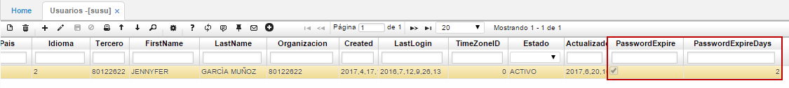
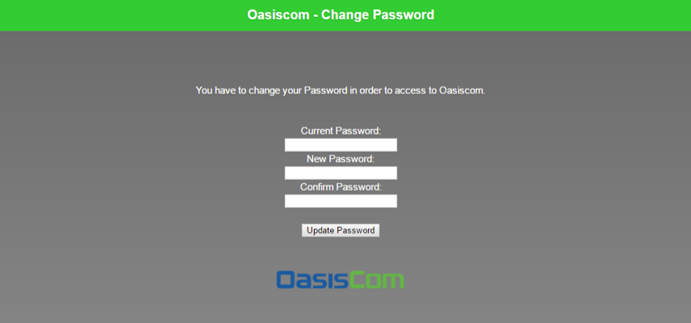
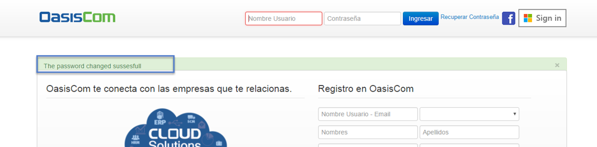
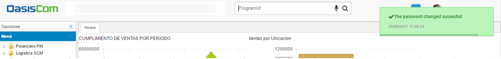

# SUSU - Usuarios

### Caducidad de Contraseñas

En la aplicación **SUSU** se debe verificar que para los usuarios que corresponda, también se encuentren configurados los campos _PasswordExpire_ y _PasswordExpireDays_. Se debe tener en cuenta que si en la aplicación [**SDOM - Dominios**](http://docs.oasiscom.com/Operacion/cloud/sbasica/sdom) no se realiza la parametrización correspondiente, pero en la opción **SUSU - Usuarios** si, el sistema tomará la parametrización de la opción **SUSU**.

Hecho esto, una vez se cumpla el tiempo de caducidad, al iniciar sesión nuevamente (con la contraseña de siempre), la aplicación mostrará la siguiente ventana solicitando el cambio de contraseña, solicitando la contraseña actual y la nueva contraseña.  

Una vez realizado el cambio, el sistema retornará a la pantalla de inicio de sesión de OasisCom, indicando que el cambio de contraseña se ha realizado.  

Al iniciar sesión el sistema mostrará un mensaje indicando que el cambio de contraseña fue exitoso.  

