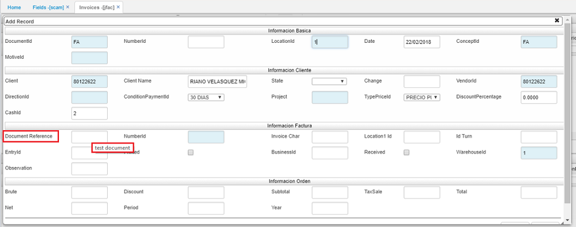
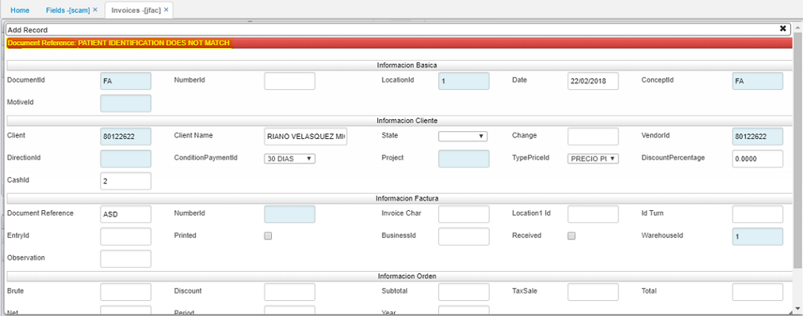

# SCAM - Campos

La aplicación SCAM permite la configuración de reglas de negocio, control, tipos de campos y su obligatoriedad por empresa.  

### Parametrizar nueva restricción

Para parametrizar una nueva restricción, es necesario diligenciar el _programa_, el _tab_ al cual pertenece el campo (0 para el maestro y para los detalles el RowId de la parametrización del spro), el _nombre del campo_ (con la ayuda del comando Shift + F11), el _código del lenguaje_ (1 Ingles, 2 Español y 5 Portugues).  

**Nombre:** ingresar la etiqueta que se asignará al campo.  
**Descripción:** colocar un texto que se mostrará como ayuda al momento de editar.  
**Obligatorio:** se puede indicar si el campo parametrizado será obligatorio.  
**ErrorId:** se puede colocar un código de un error que se encuentre parametrizado en la opción **SERR - Errores**.  
**Condicion:** se puede parametrizar (en formato JSON) el tipo de datos que se debe validar en el campo y un conjunto de reglas de negocio como validaciones booleanas.  

En el campo **"format"** se debe indicar el tipo de datos que debe validar la aplicación. Los tipos de datos que serán validados son: integer, number, date, time, datetime, url, email. Si este campo no se indica en el **JSON**, el sistema toma por defecto el formato de edición del JqGrid.  

En el campo **"customValidators"** se debe agregar una lista de condiciones lógicas que deben ser validadas, estas líneas serán unidas por medio del operador **"And"** de Javascript (&&), para hacer referencia a el valor que se está almacenado en el campo se debe utilizar la variable **"value"**.  

Si se desea hacer una validación de longitud de una cadena, se deben utilizar las funciones "maxLength(value, N)" y "minLength(value, N)" donde N es la longitud que será validada. Adicionalmente, se pueden validar expresiones regulares por medio de la función "evaluateRegex(pattern, value)" donde pattern es la expresión regular que será validada.  

### Parametrizar restricciones maestro tipo A y B

En la aplicación BBAN:  

El error parametrizado se mostrará al momento de guardar si no se cumple alguna de las condiciones parametrizadas.  

### Parametrización restricciones maestros tipo C

El error parametrizado se mostrará al momento de guardar en caso tal que no se cumpla alguna de las condiciones definidas.  

### Parametrización detalles opciones tipo B y C

El error parametrizado se mostrará al momento de guardar en caso tal que no se cumpla alguna de las condiciones definidas.  

### Parametrización Zoom

El error parametrizado se mostrará al momento de guardar en caso tal que no se cumpla alguna de las condiciones definidas.  

