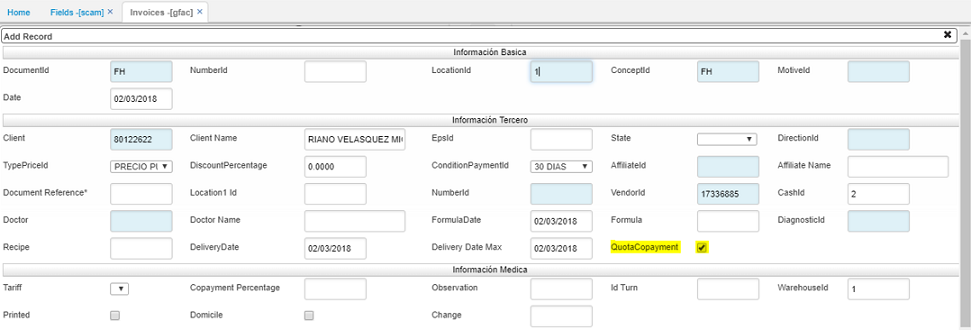
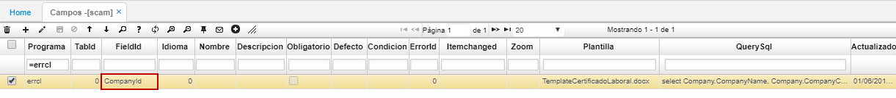
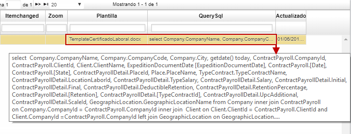
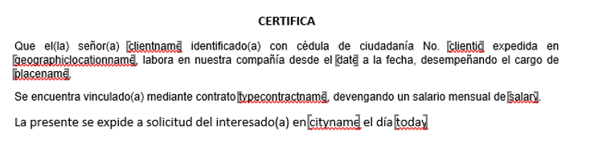
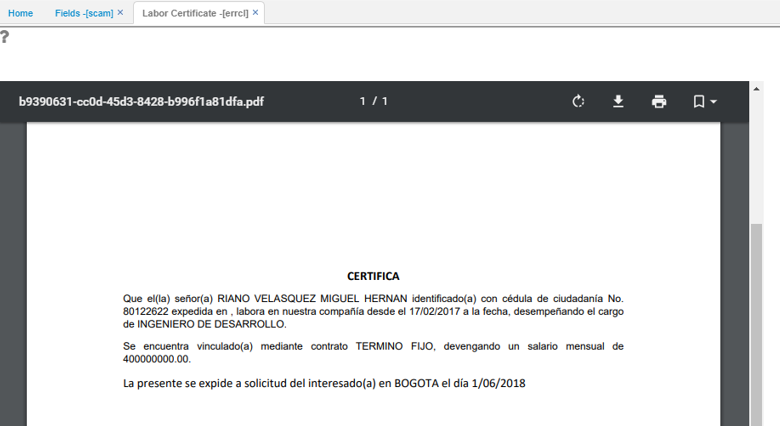

# SCAM - Campos

La aplicación SCAM permite la configuración de reglas de negocio, control, tipos de campos y su obligatoriedad por empresa.  

### Parametrizar nueva restricción

Para parametrizar una nueva restricción, es necesario diligenciar el _programa_, el _tab_ al cual pertenece el campo (0 para el maestro y para los detalles el RowId de la parametrización del spro), el _nombre del campo_ (con la ayuda del comando Shift + F11), el _código del lenguaje_ (1 Inglés, 2 Español y 5 Portugues).  

**Nombre:** ingresar la etiqueta que se asignará al campo.  
**Descripción:** colocar un texto que se mostrará como ayuda al momento de editar.  
**Obligatorio:** se puede indicar si el campo parametrizado será obligatorio.  
**ErrorId:** se puede colocar un código de un error que se encuentre parametrizado en la opción **SERR - Errores**.  
**Condicion:** se puede parametrizar (en formato JSON) el tipo de datos que se debe validar en el campo y un conjunto de reglas de negocio como validaciones booleanas.  

En el campo **"format"** se debe indicar el tipo de datos que debe validar la aplicación. Los tipos de datos que serán validados son: integer, number, date, time, datetime, url, email. Si este campo no se indica en el **JSON**, el sistema toma por defecto el formato de edición del JqGrid.  

En el campo **"customValidators"** se debe agregar una lista de condiciones lógicas que deben ser validadas, estas líneas serán unidas por medio del operador **"And"** de Javascript (&&), para hacer referencia a el valor que se está almacenado en el campo se debe utilizar la variable **"value"**.  

Si se desea hacer una validación de longitud de una cadena, se deben utilizar las funciones "maxLength(value, N)" y "minLength(value, N)" donde N es la longitud que será validada. Adicionalmente, se pueden validar expresiones regulares por medio de la función "evaluateRegex(pattern, value)" donde pattern es la expresión regular que será validada.  

### Parametrizar restricciones maestro tipo A y B

En la aplicación BBAN:  

El error parametrizado se mostrará al momento de guardar si no se cumple alguna de las condiciones parametrizadas.  

### Parametrización restricciones maestros tipo C

Ingresamos a la aplicación SCAM y realizamos los cambios deseados.  

Validamos en la aplicación correspondiente, que el cambio se haya efectuado satisfactoriamente.  

El error parametrizado se mostrará al momento de guardar en caso tal que no se cumpla alguna de las condiciones definidas.  

### Parametrización detalles opciones tipo B y C

Ingresamos a la aplicación SCAM y realizamos los cambios deseados.  

Validamos en la aplicación correspondiente, que el cambio se haya efectuado satisfactoriamente.  

El error parametrizado se mostrará al momento de guardar en caso tal que no se cumpla alguna de las condiciones definidas.  

### Parametrización Zoom

Ingresamos a la aplicación SCAM y realizamos los cambios deseados.  

Validamos en la aplicación correspondiente, que el cambio se haya efectuado satisfactoriamente.  

El error parametrizado se mostrará al momento de guardar en caso tal que no se cumpla alguna de las condiciones definidas.  

### [Parametrizar Valores por Defectos](http://docs.oasiscom.com/Operacion/system/sconfig/scam#parametrizar-valores-por-defectos)

Esta nueva funcionalidad permite declarar valores por defecto sobre campos (Listas, Fechas, Flags, etc) de aplicaciones de parametrización básica sin detalle como lo son: BBAN, BCOL. También para aplicaciones de parametrización que contengan detalle, como: BPRO, BTER, BDOC, BUBI, entre otras. Igualmente, para aplicaciones de movimientos o transacciones como lo son: CMOV, TMOV, KMOV, etc.  

A continuación veámos algunos ejemplos.  

* _Configuración en aplicaciones de parametrización con sólo maestro y con maestro y detalle._  

En el siguiente ejemplo para la aplicación BBAN - Bancos, definiremos que el campo llamado _Bank Code_ tríaga automáticamente el valor 100. Para ello, consultaremos en el campo _ProgramId_ la aplicación BBAN, seleccionamos el campo que deseamos parametrizar, en este caso _Bank Code_ e ingresamos el valor 100 en la columna _Default_. Damos click en el botón **Guardar** para salvar los cambios.  

Al crear un nuevo registro en la opción BBAN, traerá el valor 100 en el campo _Bank Code_.  

* _Configuración en aplicaciones de movimientos._  

En la aplicación GFAC - Facturas, definiremos que al crear un nuevo registro el check _QuotaCopayment_ esté activo. Para ello, igualmente consultamos la aplicación GFAC y seleccionamos el campo a parametrizar, allí en la columna _Default_ digitamos la palabra _true_.  

Al crear un registro en la aplicación GFAC.  

* _Parametrización en el detalle de aplicaciones de movimientos._  

Definiremos que al crear un renglón en el detalle de la aplicación GFAC- Facturas, el campo _Quantity_ tríga automáticamente el número 30.  

Al crear un renglón en la aplicación GFAC.  

* _Parametrización en un Zoom._  

Como ejemplo, parametrizaremos que al crear un cliente en la aplicación GFAC, el campo _ClientType_ traíga automáticamente el tipo _CÉDULA_.  

Consultamos por la opción **ZGFAC** y seleccionamos el nombre del zoom a parametrizar. En el campo _Default_ ingresamos la letra **C** correspondiente a cédula.  

Al crear un nuevo tercero en la aplicación GFAC.  

* _Parametrización de valores "NULL" para campos tipo fecha._  

Desde la opción SCAM, se permite la parametrización de  valores 'null' por defecto  en campos tipo fecha para todos los tipos de aplicaciones de OASISCOM.  

Veamos un ejemplo, se parametriza en la opción SCAM un campo donde el valor por defecto sea "NULL", es decir, el campo se muestre en blanco.  

Al abrir la opción donde se encuentra el campo parametrizado debe quedar el campo en blanco.  

Anteriormente, la aplicación arrojaba automáticamente la fecha.  

Después de realizar la parametrización, al crear un registro el campo aparecerá en blanco sin data.  

### [Mensajes de error en tiempo de edición](http://docs.oasiscom.com/Operacion/system/sconfig/scam#mensajes-de-error-en-tiempo-de-edición)

Esta funcionalidad permite enseñar mensajes de error en los campos previamente parametrizados, mientras se esté editando un registro y no solamente cuando se de click en el botón _Guardar_.

## [Parametrización de Zoom](http://docs.oasiscom.com/Operacion/system/sconfig/scam#parametrización-de-zoom)

En el campo _Zoom_ de la opción SCAM se parametrizan los zoom teniendo en cuenta lo siguiente:  

**1.** Existen 4 tipos de Zoom:  

 * ZoomOneByOne = 'N' (Zoom Normal)  
 * ZoomMultiAdd = 'M' (Zoom que adiciona el registro seleccionado -- Eje: Zoom DocumentId1 de la opción ACAT)  
 * ZoomCrud     = 'C' (Zoom con el crud normal: crear, eliminar y editar -- Eje: Zoom LotId de la opción IMOV)  
 * ZoomAdditive = 'A' (Zoom que solo crea el registro -- Eje: Zoom "Crear tercero" del GFAC al dar click derecho)  

**2.**  El campo donde se parametrizan los zoom es en el campo _Zoom_ del **SCAM** y este es en lenguaje JSON.  

**3.** Hay que tener en cuenta las 3 variables que recibe el JSON.  

 * zoomType = 'N' o 'M' o 'C' o 'A' segun el caso
 * Caption = El Label que aparecera en la lista
 * ModelZoom = El nombre del modelo del Zoom.

**4.** El JSON se hará de la siguiente manera.  

	[{zoomType:'N',Caption:'ConsultaZoomTest', ModelZoom:'DocumentZoom'}]  

**5.** Si se quiere agregar otro Zoom al mismo campo, se cierra la llave ({}) se pone la coma (,) y se vuelve abrir la llave ({}).  

	   [{zoomType:'N',Caption:'ConsultaZoomTest', ModelZoom:'DocumentZoom'},
          {zoomType:'M',Caption:'MultiEventActivityTest',ModelZoom:'EventActivityZoom'}]  

  

## [Parametrización de zoom en campos de texto](http://docs.oasiscom.com/Operacion/system/sconfig/scam#parametrización-de-zoom-en-campos-de-texto)

Por medio de la aplicación SCAM se permite la parametrización de zooms desde cualquier campo tipo texto de las aplicaciones.  

Primero, debemos identificar en dónde necesitamos crear el zoom, la aplicación, si es en el maestro o en que pestaña del detalle y el nombre del campo.  

Seguidamente, realizamos la parametrización en SCAM. Agregamos un nuevo registro y diligenciamos los siguientes campos.  

**Programa:** ingresar el nombre de la aplicación en donde se agregará el zoom.  
**Tab Id:** indicar número de la tabla en donde se agregará el zoom, es decir, si es en el maestro será la tabla **0**, en la primera pestaña del detalle será la tabla **1**, en la segunda pestaña del detalle será la tabla **2**, y así sucesivamente.  

**Field Id:** Ingresamos el nombre del campo. Para conocerlo, nos dirigimos a la aplicación, nos ubicamos en el campo y oprimimos el comando _**Shift + F11**_.  

**Idioma:** indicamos el id del idioma en que se visualice la aplicación.  
**Zoom:** ingresamos el código del zoom que se desea agregar.  

Finalmente guardamos los cambios. Para visualizar el nuevo zoom, es necesario cerrar sesión y volver a ingresar.  

Al validar en la aplicación, vemos que el campo _Rol_ ya cuenta con zoom.  

## [Templates para reportes](http://docs.oasiscom.com/Operacion/system/sconfig/scam#templates-para-reportes)

Esta funcionalidad permite la parametrización de un formato de Word para que funcione como template en lugar de un archivo _RDLC_ existente para estas opciones.  

En la opción SCAM se debe parametrizar el nombre del Template (Plantilla) y el Query que se va a ejecutar.  

El Query debe tener los mismos parametros que tiene el reporte de tipo RDLC.  

El campo al cual debe quedar asociado el template siempre debe ser el campo CompanyId.  

En los campos _Plantilla_ y _QuerySql_.  

**QuerySql:**  

		select  Company.CompanyName, Company.CompanyCode, Company.City, getdate() today, ContractPayroll.CompanyId, ContractPayroll.ClientId, Client.ClientName, ExpeditionDocumentDate [ExpeditionDocumentDate], ContractPayroll.[Date], ContractPayroll.[State], ContractPayrollDetail.PlaceId, Place.PlaceName, TypeContract.TypeContractName, ContractPayrollDetail.LocationLaborId, ContractPayrollDetail.TypeSalary, ContractPayrollDetail.Salary, ContractPayrollDetail.Initial, ContractPayrollDetail.Final, ContractPayrollDetail.DeductibleRetention, ContractPayrollDetail.RetentionPercentage, ContractPayrollDetail.[Retention], ContractPayrollDetail.[TypeContractId], ContractPayrollDetail.UpcAdditional, ContractPayrollDetail.ScaleId, GeographicLocation.GeographicLocationName from Company inner join ContractPayroll  	on Company.CompanyId = ContractPayroll.CompanyId inner join  Client on Client.ClientId = ContractPayroll.ClientId and  Client.CompanyId =ContractPayroll.CompanyId left join GeographicLocation on GeographicLocation.CompanyId = Client.CompanyId and GeographicLocation.GeographicLocationId = Client.DocumentLocationId inner Join ContractPayrollDetail On ContractPayrollDetail.CompanyId = ContractPayroll.CompanyId  and ContractPayrollDetail.NumberId = ContractPayroll.NumberId  and ContractPayrollDetail.DocumentId = ContractPayroll.DocumentId  and ContractPayrollDetail.LocationId = ContractPayroll.LocationId  Inner Join Place On ContractPayrollDetail.CompanyId = Place.CompanyId  and ContractPayrollDetail.PlaceId = Place.PlaceId left join TypeContract on TypeContract.CompanyId = ContractPayrollDetail.CompanyId and TypeContract.TypeContractId = ContractPayrollDetail.TypeContractId WHERE ContractPayroll.ClientId=@pvUser and ContractPayroll.CompanyId=@pCompany Order By ContractPayrollDetail.Salary DESC.  

El anterior ejemplo es de la aplicación _ERRCL - Certificado Laboral_ en donde el sistema debe completar los campos de acuerdo con el usuario que requiera el certificado laboral.  

La plantilla en Word:  

Al abrir la opción (en este caso la ERRCL - Certificado Laboral) la aplicación detecta que hay una plantilla parametrizada y completa la información de los marcadores presentes dentro del documento.  

Para generar el reporte _ERRCL - Certificado Laboral_, se debe parametrizar en el _SPER - Perfil_ el tercero de un documento existente en la opción _NCNT - Contratos_.  

