## Archivos - BARC

### Parametrización XML

Para la generación o descarga de un archivo en formato _.XML_ a través de un formato _.XSD_ se deben realizar las siguientes parametrizaciones iniciales en BARC:  

##### **Bajar Archivos**

En la aplicación **BARC** se debe realizar la parametrización de la estructura del archivo a bajar de la siguiente manera:  

##### **_Maestro_**

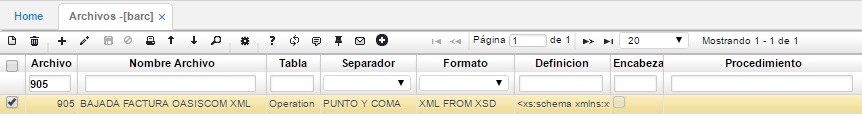

En el maestro se agrega un nuevo registro y se diligencian los siguientes campos:  

**Archivo:** ingresar el número de archivo a parametrizar.  
**Nombre Archivo:** ingresar el nombre del archivo a parametrizar.  
**Formato:** seleccionar el formato del archivo a generar. En este caso, se debe seleccionar de la lista _XML FROM XSD_.  
**Denifición:** este campo es uno de los más importantes, dado que aquí es donde se debe ingresar la estructura del archivo en formato XSD. El formato XSD es el que nos definirá la estructura del xml a generar. A continuación, un ejemplo de un formato XSD.

	<xs:schema xmlns:xs="http://www.w3.org/2001/XMLSchema" attributeFormDefault="unqualified" elementFormDefault="qualified"><xs:element name="ROWS"><xs:complexType><xs:sequence><xs:element name="OPERATIONS"><xs:complexType><xs:sequence><xs:element name="OPERATION"><xs:complexType><xs:sequence><xs:element name="COMPANYID" type="xs:unsignedByte" /><xs:element name="DOCUMENTID" type="xs:string" /><xs:element name="NUMBERID" type="xs:unsignedByte" /><xs:element name="LOCATIONID" type="xs:unsignedByte" /><xs:element name="DATE" type="xs:dateTime" /><xs:element name="CLIENTID" type="xs:unsignedInt" /><xs:element name="EXPIRATION" type="xs:dateTime" /><xs:element name="STATE" type="xs:dateTime" /></xs:sequence></xs:complexType></xs:element><xs:element maxOccurs="unbounded" name="OPERATIONDETAIL"><xs:complexType><xs:sequence><xs:element name="COMPANYID" type="xs:unsignedByte" /><xs:element name="DOCUMENTID" type="xs:string" /><xs:element name="NUMBERID" type="xs:unsignedByte" /><xs:element name="LOCATIONID" type="xs:unsignedByte" /><xs:element name="ROWID" type="xs:unsignedByte" /><xs:element name="OBSERVATION" type="xs:unsignedByte" /><xs:element name="QUANTITY" type="xs:decimal" /><xs:element name="PRICE" type="xs:float" /><xs:element name="TAXSALEPERCENTAGE" type="xs:decimal" /><xs:element name="DISCOUNTPERCENTAGE" type="xs:float" /><xs:element name="TOTAL" type="xs:decimal" /></xs:sequence></xs:complexType></xs:element></xs:sequence></xs:complexType></xs:element></xs:sequence></xs:complexType></xs:element></xs:schema>  

**QuerySql:** se debe ingresar la consulta a nivel de base de datos para generar el formato con los datos necesitados tanto de maestro y detalle, de la siguiente manera:

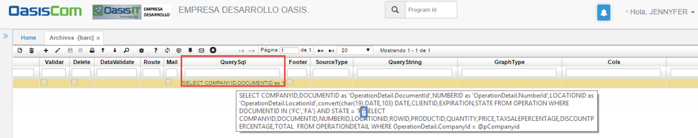

_IMPORTANTE_: cada consulta (sentencia) debe estar separada por ‘;’ (punto y coma) como se muestra en el recuadro azul.  

##### **_Detalle_**

Terminada la parametrización del maestro, se procede con el detalle:

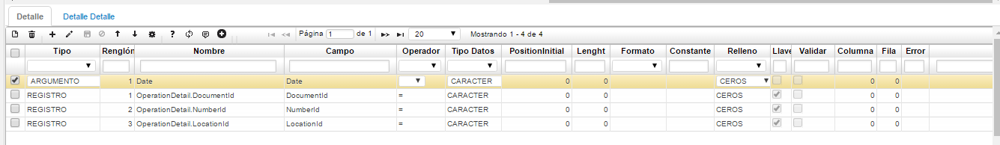

**Tipo:**

 * Para el primer renglón que corresponde a _Date_, se selecciona el tipo **Argumento**, dado que este será el campo sobre el cuál será bajado el archivo desde la aplicación BINT (Descrita más adelante). Además, que corresponde al parámetro sobre el cuál serán consultados los registros maestros (padres) del archivo a generar.  

 * Para los renglones restantes _OperationDetail.DocumentId, OperationDetail.NumberId_ y _OperationDetail. LocationId_, el tipo corresponde a **Registro**, dado que son los campos de referencia entre maestro y detalle, es decir las llaves.

**Renglón:** ingresar el número del renglón correspondiente al registro.  
**Nombre:** ingresar el nombre del campo. Se debe tener en cuenta que cuando el campo corresponde a un detalle, se debe ingresar el nombre de la tabla y el nombre del campo, estos dos separados por un punto **(.)**.  
**Campo:** ingresar los nombres de los campos a los cuales haga referencia.Aquí, cuando los campos corresponden al detalle no se debe colocar el nombre de la tabla de donde provienen.  
**Operador:** seleccionar el operador del dato, por ejemplo, para los campos _DocumentId_, _NumberId_ y _LocationId_ el operador corresponde a _=_, es decir, que retornará los datos en donde maestro y detalle sean iguales.  
**Tipo Datos:** seleccionar el tipo de dato del campo, si corresponde a numérico, carácter, valor, fecha, etc.  
**Llave:** se debe activar el flag para los campos que corresponden a llaves foráneas, entre maestro y detalle, es decir, _DocumentId_, _NumberId_ y _LocationId_.  

Hecho esto, se ha culminado con la parametrización en la opción BARC y se podrá continuar con la parametrización en [**BPUB - Publicaciones**](https://github.com/OasisCom/Docs/blob/master/Operacion/utility/barchi/bpub.md) y  [**SROL - Roles**](https://github.com/OasisCom/Docs/blob/master/Operacion/System/sacceso/srol.md).  

#### Subir Archivos

Para la subida de archivos en formato _.XML_ a través de un formato _.XSD_ se deben realizar las siguientes parametrizaciones iniciales.  

En la aplicación BARC, se parametrizará la estructura del archivo a subir de la siguiente manera:  

##### **Maestro**

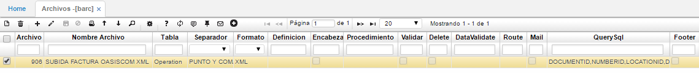

En el maestro se agrega un nuevo registro y se diligencian los siguientes campos:  

**Archivo:** ingresar el número que será asignado al archivo.  
**Nombre Archivo:** ingresar el nombre del archivo a parametrizar.  
**Formato:** seleccionar el formato del archivo a generar. En este caso, se debe seleccionar de la lista _XML_.  

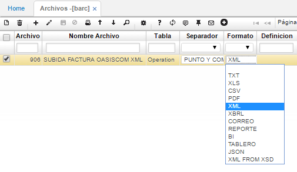

**QuerySql:** se debe ingresar la consulta a nivel de base de datos de la siguiente manera, esto para subir el formato con los datos requeridos tanto en maestro como en detalle.  

	CAMPO1,CAMPO2,CAMPO3;TABLAMAESTRO#CAMPO1,CAMPO2,CAMPO3;TABLADETALLE

 * Cada campo de la sentencia estará separado por el símbolo (,)  
 * La tabla de cada sentencia estará enseguida del símbolo (;)  
 * La separación de cada sentencia estará precedida del símbolo (#)  

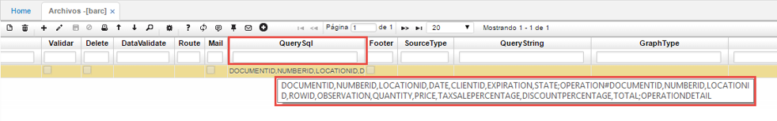

**Operación:** seleccionar la operación _INSERT_, la cual permite únicamente la inserción de registros sobre las tablas trabajadas.  

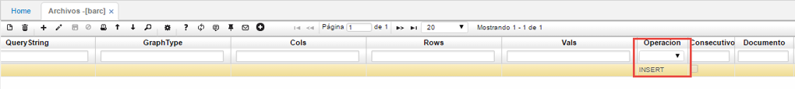

##### **_Detalle_**

Terminada la parametrización del maestro, se procede con el detalle:

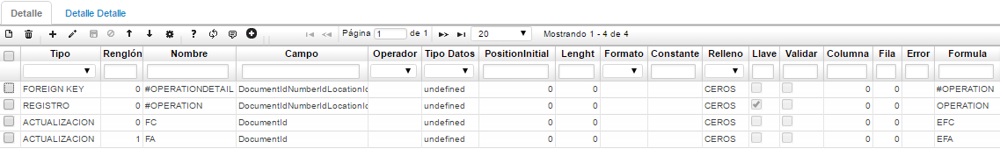

 * **Primer registro:** 

 **Tipo:** seleccionaremos la opción _FOREIGN KEY_.  
 **Nombre:** digitar la tabla _#OPERATIONDETAIL_.  
 **Campo:** digitar sin espacios _DocumentIdNumberIdLocationId_.  
**Formula:** digitar la tabla #OPERATION.  

  El simbolo **_#_** indica que son tablas temporales, con las cuales se realiza la validación de la consistencia de la información de los campos _DocumentId_, _NumberId_, y _LocationId_ (descritos en la columna **Campo** y sin espacios) que corresponden a las llaves entre los registros del maestro y el detalle.  
  
  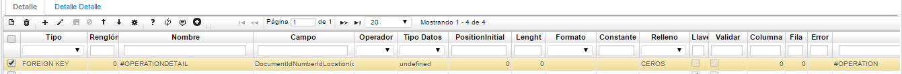
  
 * **Segundo Registro**

 En el segundo renglón, en el campo **Tipo** se deberá seleccionar la opción _REGISTRO_, lo que significa que se realiza la misma validación de consistencia de información de los campos _DocumentId_, _NumberId_, y _LocationId_ (descritos en la columna **Campo** y sin espacios), pero esta vez es de la tabla _#OPERATION_ descrita en el campo **Nombre**, (que corresponde a una tabla temporal) contra la misma tabla _OPERATION_ descrita en el campo **Formula**, pero esta ya es la tabla definitiva que corresponderá a la subida del archivo como tal. De ahí también puede verse que el flag de la columna **Llave** se encuentra activo.  
 
 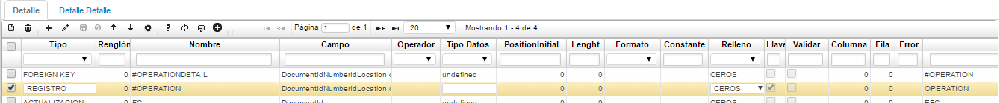
 
 * **Tercer y Cuarto Registro**

 En el tercer y cuarto renglón, en el campo **Tipo** se deberá seleccionar la opción _ACTUALIZACIÓN_, en donde la función de estos dos registros es realizar el reemplazo del campo _DocumentId_ descrito en la columna **Nombre**, es decir, aquellos registros que tengan en el campo _DocumentId_, _FC_ o _FA_, los reemplazará por _EFC_ o _EFA_ respectivamente, que son los datos descritos en el campo **Formula**. La actualización de los valores solo se realiza en las tablas temporales es decir las que tienen el símbolo de (_#_).  

  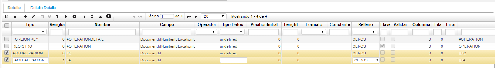

Hecho esto, se ha culminado con la parametrización en la opción BARC y se podrá continuar, al igual que con la bajada de archivos, con la parametrización en [**BPUB - Publicaciones**](https://github.com/OasisCom/Docs/blob/master/Operacion/utility/barchi/bpub.md) y  [**SROL - Roles**](https://github.com/OasisCom/Docs/blob/master/Operacion/System/sacceso/srol.md).

