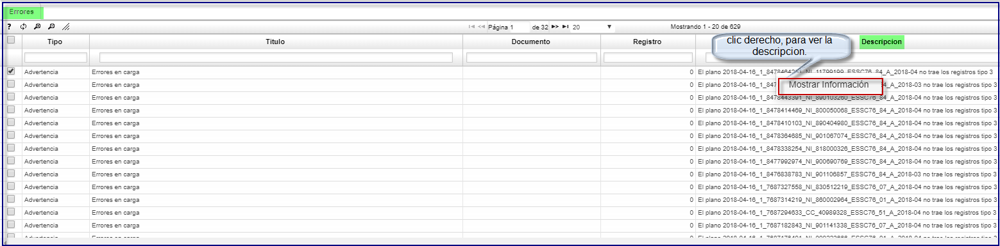
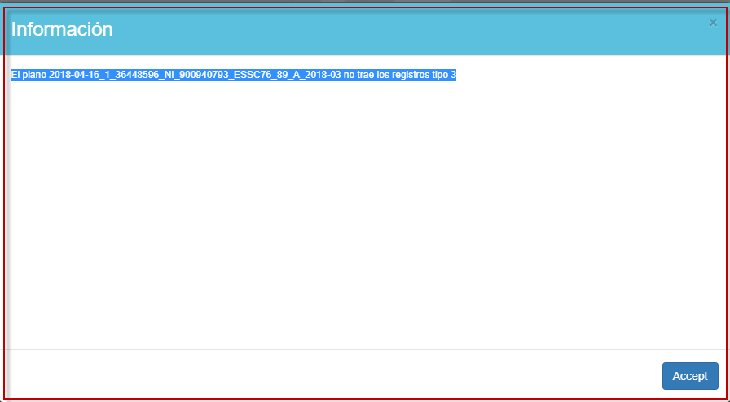

# Error_Interfaces - BERR

Esta aplicación permite realizar  validacion del **_log_** de errores, presentados en la interface.
En el detalle pestaña _Errores_, campo descripción se detalla el _log_

## **detalle**

* En el detalle del [BERR] puede visualizar la descripcion, con clic derecho _Mostrar_Informacion_  

  

Se despliega la siguiente pantalla.  

  

*******

