# Interfaces - BINT

Esta aplicación permite cargar o descargar información sobre diferentes escenarios del sistema OasisCom, de acuerdo a una parametrización previa.  

## [Medios Magnéticos](http://docs.oasiscom.com/Operacion/utility/barchi/bint#medios-magnéticos)

En este caso, BINT permite descargar la información necesaria para generar los Médios Magnéticos.

**Publicación:** seleccionar de la lista desplegable el archivo que se desea descargar.  
**Operación:** seleccionar cual es la operación que se desea realizar para el archivo seleccionado, en el caso de medios magnéticos, _Descargar_.  
**Año:** indicar el año correspondiente a la generación del formato seleccionado.  
**Id Formato:** ingresar el número del formato seleccionado anteriormente en el campo publicación.  

Estos dos últimos campos _Año y Id Formato_ es importe que coincidan con la información del formato seleccionado, puesto que, de no ser así el sistema no descargará la información correcta.  

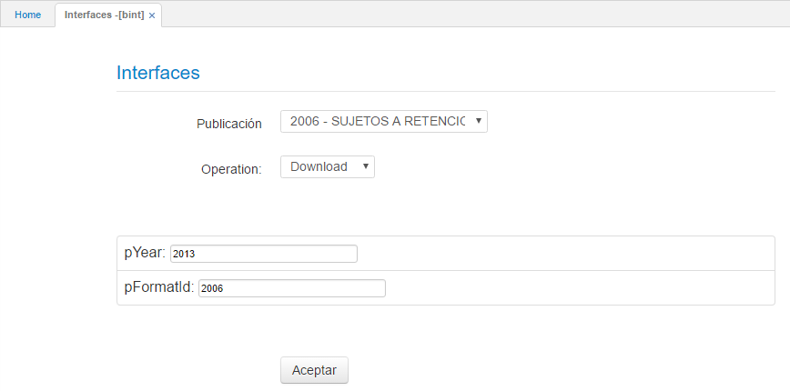

Ingresados los datos dar click en _Aceptar_, el sistema descargará el archivo seleccionado en un formato de Excel al cual se le deberá cambiar la extención del documento de _xlsx_ a _xls_, eliminando la última _x_. La información quedará en el mismo formato que lo exige la DIAN, dicho formato se puede validar en la página web de la entidad.  

Se debe tener en cuenta en el documento de Excel que se vaya a cargar a la DIAN, eliminar la columna en donde se indica el número del formato, puesto que, este número es interno del sistema OasisCom y no es necesario en la información que se vaya a enviar.  

## [Parametrización XML](http://docs.oasiscom.com/Operacion/utility/barchi/bint#parametrización-xml)

En BINT - Interfaces, generaremos el archivo de la publicación parametrizada anteriormente en la aplicación  [**BPUB - Publicaciones**](http://docs.oasiscom.com/Operacion/utility/barchi/bpub). Para ello, seleccionaremos la publicación de la lista desplegable del campo _Publicación_.  

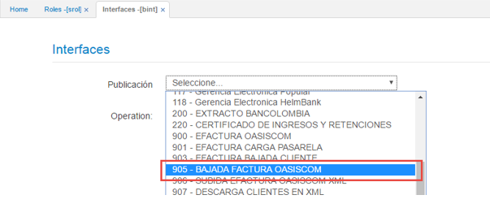

#### **Descarga de archivos**

Al seleccionar la publicación, el sistema automáticamente asignará en el campo _Operación_ la opción **Download** y habilitará el campo _Date_, recordemos que este fue el campo colocado como tipo argumento en el detalle de la aplicación [**BARC - Archivos**](http://docs.oasiscom.com/Operacion/utility/barchi/barc), en este campo ingresaremos la fecha desde la cual se requiere descargar el archivo.  

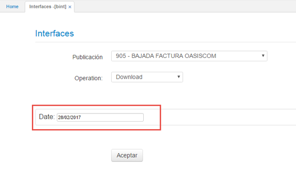

Realizado lo anterior, damos click en el botón **Aceptar**. El sistema generará un archivo en el navegador Internet Explorer mostrando los registros descargados en formato _.XML_.  

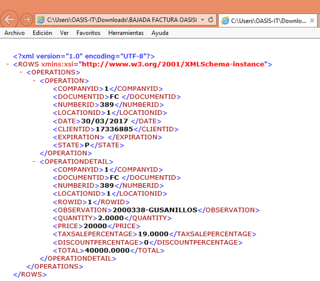

#### **Carga de archivos**

Para subir un archivo se debe seleccionar la publicación previamente parametrizada de la lista del campo **Publicación**. El siguiente campo **Operación** será diligenciado automáticamente con la opción _Upload_.  

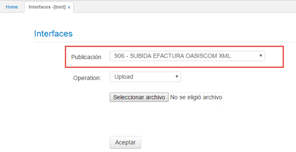

Seguidamente, dar click en el botón **Seleccionar archivo** y elegir de allí el que se desea cargar, tener presente que debe estar en formato _.XML_.  

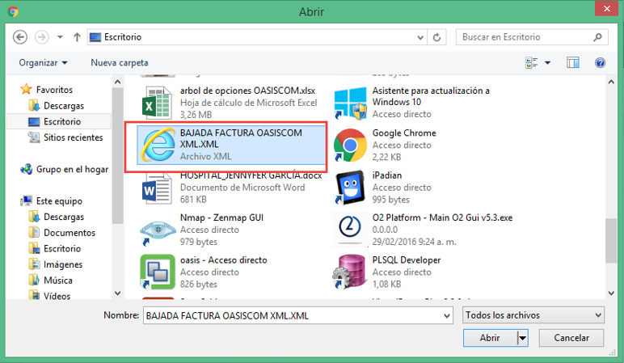

Al seleccionar el archivo se debe dar clic en _Aceptar_ y posteriormente se cargará al sistema.  

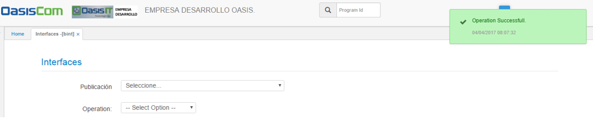

Para verificar la información cargada en el sistema por medio de BINT - Interfaces, se puede acceder a las aplicaciones **EFFAC - Facturas** o **EOFAC - Facturas de Compra**.

## [Archivos planos de Salud](http://docs.oasiscom.com/Operacion/utility/barchi/bint#archivos-planos-de-salud)

En la aplicación BINT se crearon los _Dynamic_ para archivos planos (Movimientos), que permiten realizar algunos ajustes previamente con los registros antes de descargar los archivos oficiales.  

Al ingresar a la aplicación se debe seleccionar el archivo según su movimiento en el área de aseguramiento.  

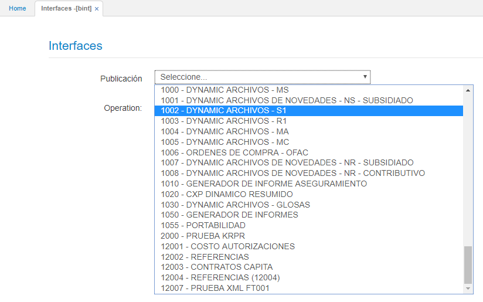

Seguidamente, seleccionamos la operación que se desea hacer con el _Dynamic_.  

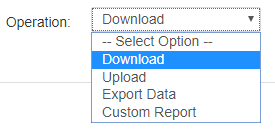

En la parte inferior, damos click en el botón , el cual nos arrojará una vista previa de la plantilla con la información contenida en la publicación seleccionada anteriormente.  

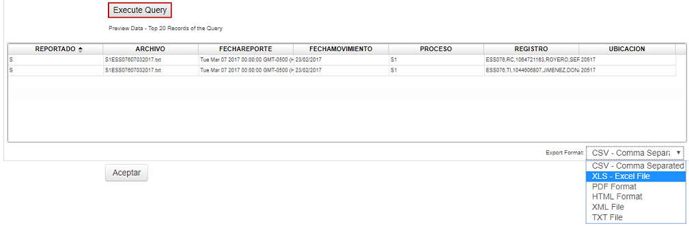

Seleccionamos de la lista desplegale _Export Format_, el formato en el cual se desea descargar y finalmente damos click en el botón _Aceptar_.  

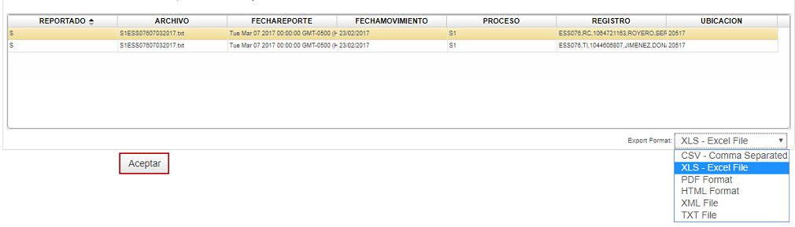

A continuación se puede observar que el archivo ha sido descargado en el formato seleccionado.  

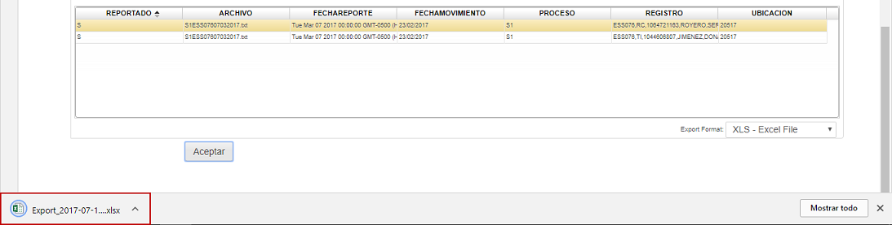

El documento se visualizará de la siguiente manera y estará listo para editar en caso que se requiera.  

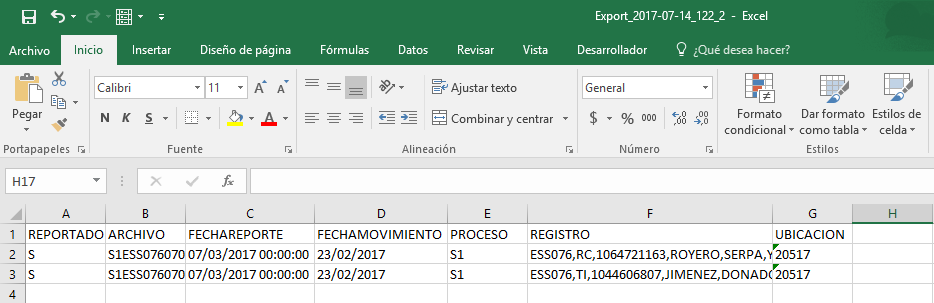

# [Archivos Conciliación Salud](http://docs.oasiscom.com/Operacion/utility/barchi/bint#archivos-conciliación-salud)

Los archivos planos utilizados para realizar la conciliación de salud deben ser cargados por la aplicación **BINT - Interfaces**. Para cargar los archivos del operador se utilizarán la interfaz **59 - Archivo Operador Pila** correspondiente a los usuarios activos y la interfaz **62 - Operador Pensionado** correspondiente a los usuarios pensionados.

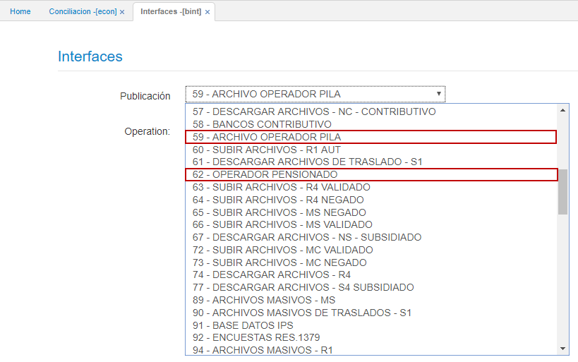

Para cargar el archivo plano enviado por el banco se hará uso de la interfaz **58 - Bancos Contributivos**.

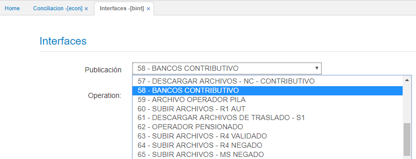

Seleccionada la interfaz correspondiente, indicamos la operación _Upload_ y buscamos el archivo plano ya sea del operador o del banco en el equipo local dando click en el botón **_Seleccionar archivo_**, finalmente damos click en el Botón .

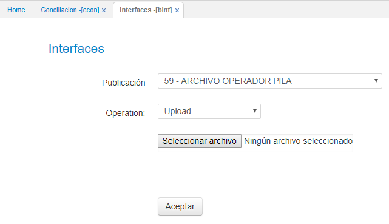

La información cargada se podrá ver reflejada en la aplicación [**ELIQ- Liquidaciones**](http://docs.oasiscom.com/Operacion/is/salud/eafiliacion/movafi/eliq), en donde se creará un documento _PO - Planilla Operador_ para cada uno de los archivos, igualmente, se crearán los documentos _ER - Conciliación Salud_ en la aplicación [**ECON - Conciliación**](http://docs.oasiscom.com/Operacion/is/salud/eafiliacion/movafi/econ), en donde se podrá realizar la conciliación de los aportes que se realizarán.  

# [Parámetros en Mensajes de Error](http://docs.oasiscom.com/Operacion/utility/barchi/bint#parámetros-en-mensajes-de-error)

La aplicación _BINT_ tiene la funcionalidad de arrojar en los mensajes de error los parámetros que se deben configurar correctamente para poder ejecutar una publicación.  

Por ejemplo, seleccionaremos la publicación **3. Bancos** y la operación **Download** y damos click en _Aceptar_.  

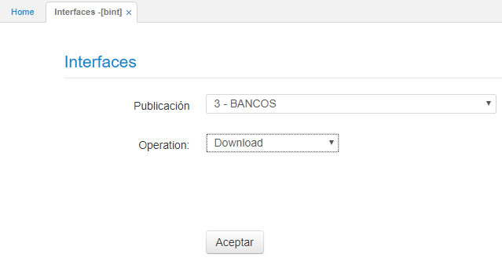

Al dar click en _Aceptar_ nos arrojará el siguiente error.  

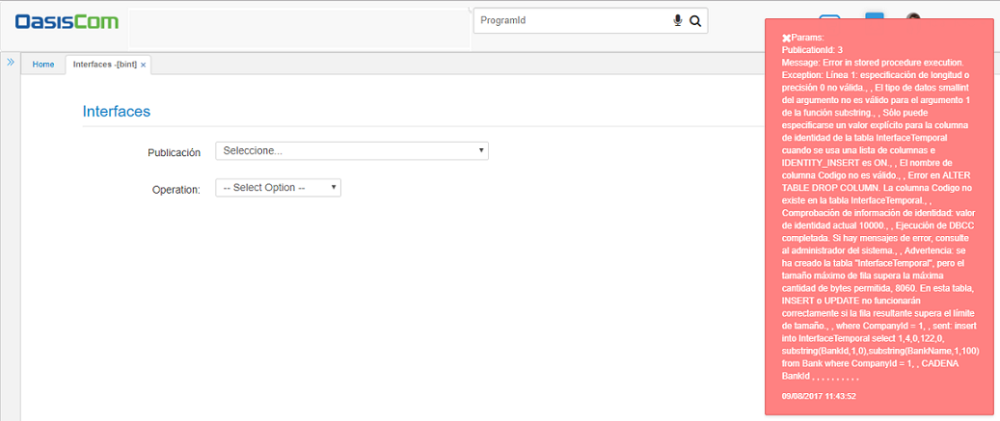
  
  Configurando los parámetros contenidos en el mensaje de error, se podrá ejecutar correctamente la publicación seleccionada.  

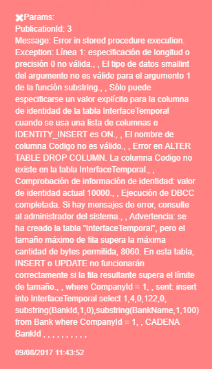

# [Subir productos al Marketplace](http://docs.oasiscom.com/Operacion/utility/barchi/bint#subir-productos-al-marketplace)

El propósito de esta funcionalidad es permitir que un cliente pueda subir de forma masiva, a través de la opción **BINT** y un archivo plano, la información básica de los productos que desea ofertar en el MarketPlace de OASISCOM. El archivo deberá contener la información del Código de producto (del cliente), nombre del producto y el código de la clasificación asociada al producto y que debe corresponder al maestro de clasificación que OASISCOM proporcionará.  

### Consideraciones

El sistema, al cargar el archivo, tomará el código de producto que viene en el archivo y lo pondrá como código antiguo del producto definitivo que quedará en el maestro de productos [**BPRO - Productos**](http://docs.oasiscom.com/Operacion/common/bprodu/bpro). OASISCOM asignará de forma automática el código de producto OASIS en el maestro de productos. Los productos cargados al sistema, quedarán asociados con el código de la organización a la cual pertenece el usuario que realiza la carga, y dicho dato estará registrado en el campo _Tercero_ del producto en el maestro de productos.  

### Estructura del archivo

El archivo que el sistema aceptará para la carga masiva de los productos, deberá ser un archivo con extensión TXT y los datos deberán estar separados por coma (,), cumpliendo con la siguiente estructura:  

_Ejemplo:_ 0,Producto MarketPlace,abc123,0,4  

**Dato 1:** Valor fijo en 0.  
**Dato 2:** Nombre del producto. Valor alfanumérico. Longitud máxima de 1000 caracteres.  
**Dato 3:** Código del producto (Proveedor). Valor alfanumérico. Longitud máxima de 30 caracteres.  
**Dato 4:** Valor fijo en 0.  
**Dato 5:** Código de la clasificación asociada al producto. Correspondiente con el maestro de clasificaciones definida por OASISCOM. Valor numérico.  

### Funcionamiento

El usuario deberá ingresar por la aplicación **BINT**, elegir la interfaz correspondiente a la subida de productos para MarketPlace, seleccionar el archivo a subir y ejecutar la interfaz.  

Si el archivo cumple con la estructura y los datos son validos, el sistema mostrará un mensaje de ejecución exitosa.  

Una vez ejecutada la interfaz, los productos cargados desde el archivo se podrán visualizar en el maestro de productos [**BPRO - Productos**](http://docs.oasiscom.com/Operacion/common/bprodu/bpro).

### Validaciones

Si un código de producto que viene en el archivo, para la organización a la que pertenece el usuario que está haciendo la carga de datos, ya se encuentra en el maestro de Productos [**BPRO - Productos**](http://docs.oasiscom.com/Operacion/common/bprodu/bpro), el sistema no cargará la información y mostrará un mensaje de control.  

# [Subir precios al Marketplace](http://docs.oasiscom.com/Operacion/utility/barchi/bint#subir-precios-al-marketplace)

El propósito de esta funcionalidad es permitir que un cliente pueda subir de forma masiva, a través de la opción **BINT** y un archivo plano, la información de los precios de los productos que desea ofertar en el MarketPlace de OASISCOM. El archivo deberá contener la información del código de producto (del cliente), Tipo de Precio que debe corresponder al maestro de [**FBTP - Tipos de Precio**](http://docs.oasiscom.com/Operacion/scm/facturacion/fbasica/fbtp) que OASISCOM proporcionará, la fecha de entrada en vigencia de dicho precio y el valor.  

### Consideraciones

El sistema al cargar el archivo, tomará el código de producto que viene en el archivo e identificará cual es el código OASIS que le corresponde a dicho producto en el maestro de productos [**BPRO - Productos**](http://docs.oasiscom.com/Operacion/common/bprodu/bpro), para hacer la correcta inserción de los datos en la lista de precios del MarketPlace.  

### Estructura del archivo

El archivo que el sistema aceptará para la carga masiva de los productos, deberá ser un archivo con extensión TXT y los datos deberán estar separados por coma (,), cumpliendo con la siguiente estructura:  

_Ejemplo:_ abc123,0,0,01/09/2017,2660

**Dato 1:** Código del producto (Proveedor). Valor alfanumérico. Longitud máxima de 30 caracteres.  
**Dato 2:** Valor fijo en 0.  
**Dato 3:** Codigo del tipo de precio. Correspondiente con el maestro de tipos de precios definidos por OASISCOM. Valor numérico. Valor por defecto 1.  
**Dato 4:** Fecha desde la cual entra en vigencia el precio. Dato tipo Fecha. Formato dd/mm/yyyy.  
**Dato 5:** Precio del producto. Valor numérico. Acepta decimales.  

### Funcionamiento

El usuario deberá ingresar por la aplicación **BINT**, elegir la interfaz correspondiente a la subida de precios para MarketPlace, seleccionar el archivo a subir y ejecutar la interfaz.  

Si el archivo cumple con la estructura y los datos son validos, el sistema mostrará un mensaje de ejecución exitosa.  

Una vez ejecutada la interfaz, los precios cargados desde el archivo se podrán visualizar en el maestro de precios [**FPRE - Precios**](http://docs.oasiscom.com/Operacion/scm/facturacion/fprecio/fpre).  

### Validaciones

Si un código de producto que viene en el archivo, para la organización a la que pertenece el usuario que está haciendo la carga de datos, no se encuentra en el maestro de Productos [**BPRO - Productos**](http://docs.oasiscom.com/Operacion/common/bprodu/bpro), el sistema no cargará la información y mostrará un mensaje de control.  

Si un precio del producto que viene en el archivo, para el tipo de precio y fecha de vigencia ya se encuentra en el maestro de Precios [**FPRE - Precios**](http://docs.oasiscom.com/Operacion/scm/facturacion/fprecio/fpre), el sistema actualizará el valor para dicho producto.  

# [Carga de imágenes al MarketPlace](http://docs.oasiscom.com/Operacion/utility/barchi/bint#carga-de-imágenes-al-marketplace)

En la aplicación BINT se verificará la parametrización realizada previamente en [**BARC - Archivos**](http://docs.oasiscom.com/Operacion/utility/barchi/barc) y se cargará el archivo con las imágenes.  

Para ello, el usuario deberá ingresar a la opción BINT y elegir la _publicación_ correspondiente a SUBIDA DE IMÁGENES DE PRODUCTOS:  

Posteriormente, la opción cargará el campo _Operación_ correspondiente a Subida (Upload):  

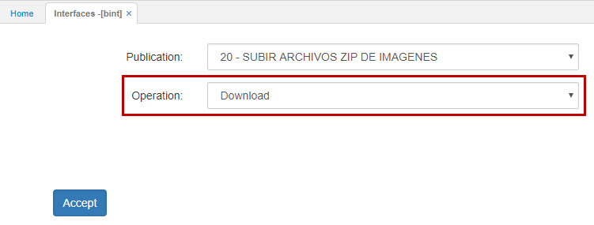

Como siguiente paso debe seleccionar el archivo a cargar:  

Por último damos click en _Aceptar_ y el sistema mostrará un mensaje de operación exitosa:  

Una vez ejecutada la interfaz, las imágenes de los productos podrán ser visualizadas desde la opción [**MBPRO - Productos**](http://docs.oasiscom.com/Operacion/mpportal/mpproveedor/mbpro#verificar-cargue-de-imágenes-al-marketplace). _(Ver aplicaición)_  

## Verificaciones  

En el caso de que no exista fórmula en la parametrización de la aplicación [**BARC - Archivos**](http://docs.oasiscom.com/Operacion/utility/barchi/barc#carga-de-imágenes-al-marketplace), si el usuario ingresa el Id de producto cuyos caracteres correspondan a un String, este arrojará el siguiente mensaje de control:  

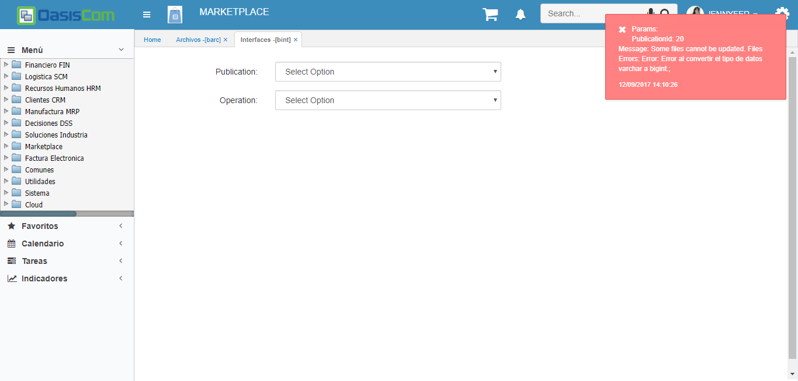

Si existe un producto con una imagen previamente cargada y se carga otra imagen asociada a este mismo producto, la imagen se sobrescribirá dado que la lógica  utilizada maneja un _update_.  

# [**Envío de facturas a la DIAN**](http://docs.oasiscom.com/Operacion/utility/barchi/bint#Envío-de-facturas-a-la-DIAN)

Los documentos que se enviarán a la DIAN serán facturas y notas generadas a la facturación. Desde la opción **BINT** con la publicación _906_ se realizará la subida de la factura en formato XML. Con la publicación _907_ se permitirá el envío de facturas para verificación del servicio web de la DIAN.  

Seleccionamos la publicación _906 - Subida efactura OasisCOm XML_, la operación _Upload_ y dando click en el botón _Seleccionar archivo_ cargamos la factura en formato XML.  

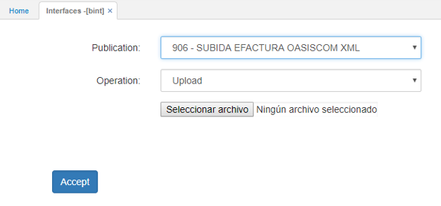

Seleccionamos el archivo. Dicho archivo es el mismo que se obtiene al ejecutar la bajada de facturas desde la opción BINT.  

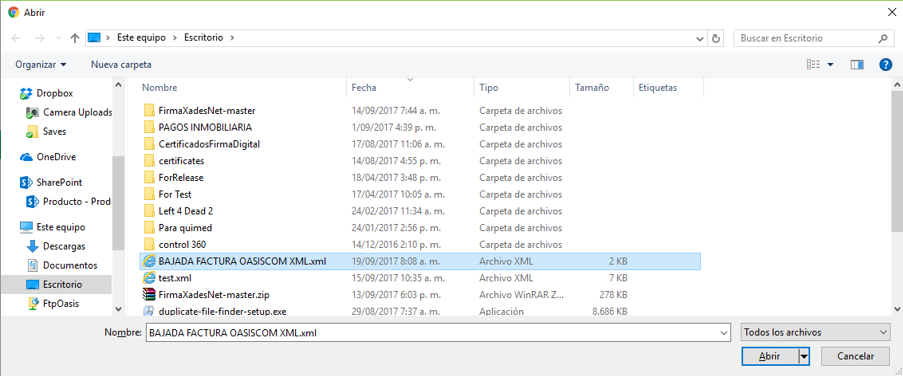

Al seleccionarlo y dar click en el botón _Aceptar_, el sistema arrojará un mensaje de control indicando que la operación se realizó satisfactoriamente.  

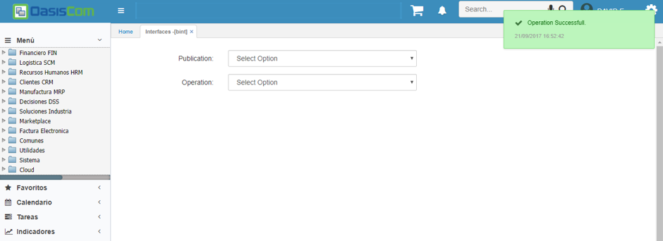

La subida del archivo anterior, se ejecuta para que las facturas a enviar a la DIAN estén debidamente identificadas y disponibles para el proceso de envío.  

Luego de dicha subida, se ejecuta el proceso de envío a la DIAN, el cual se efectúa desde BINT mediante la publicación _907 - Send DIAN files_.  

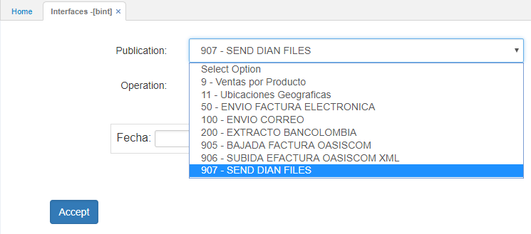

Seleccionamos la fecha de las facturas que se quieran enviar o podemos dejar en blanco el campo para que las tome todas.  

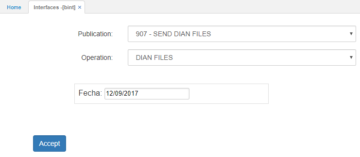

Finalmente, se obtiene el mensaje del servicio de la DIAN donde se muestra que la factura fue enviada y pasará a verificación de la DIAN.  

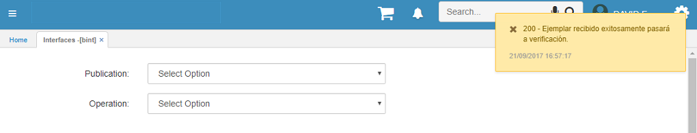
