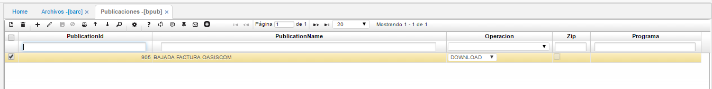

## Publicaciones - BPUB

### Parametrización XML

Parametrizado anteriormente el archivo en [**BARC - Archivos**](https://github.com/OasisCom/Docs/blob/master/Operacion/utility/barchi/barc.md), en la aplicación BPUB se deberá realizar la parametrización de la publicación para que esta pueda ser visualizada en la opción [**BINT - Inferfaces**](https://github.com/OasisCom/Docs/blob/master/Operacion/utility/barchi/bint.md).  

**_Maestro_**

En el maestro de la aplicación se deberá agregar un nuevo registro y diligenciar los siguientes campos:

**PublicaciónId:** ingresar el número de la publicación. Este debe ser el mismo número ingresado en el campo _Archivo_ de la opción [**BARC - Archivos**](https://github.com/OasisCom/Docs/blob/master/Operacion/utility/barchi/barc.md).  
**Nombre Publicación:** ingresar el nombre de la publicación. Este debe ser el mismo nombre que se ingresó en el campo _Nombre Archivo_ de la opción [**BARC - Archivos**](https://github.com/OasisCom/Docs/blob/master/Operacion/utility/barchi/barc.md).  
**Operación:** seleccionar la funcionalidad a ejecutar, en este caso, será _DOWNLOAD_.  

**_Detalle_**

En el detalle de la aplicación se deberá agregar un nuevo registro y diligenciar los siguientes campos:

**Renglón:** ingresa el número del renglón correspondiente al registro.  
**Archivo:** seleccionar del zoom el número del archivo que fue previamente parametrizado en la opción [**BARC - Archivos**](https://github.com/OasisCom/Docs/blob/master/Operacion/utility/barchi/barc.md).  
**Nombre Archivo:** este campo se diligencia automáticamente una vez sea seleccionado el campo _Archivo_.

Realizado lo anterior, se culmina con la parametrización en BPUB y se procede a asignar los permisos para la visulaización y carga o descarga de la publicación en [**SROL - Roles**](https://github.com/OasisCom/Docs/blob/master/Operacion/System/sacceso/srol.md).