# AANA - Análisis de Calidad

Para realizar el análisis de calidad, se debe crear un documento en la opción **AANA**, teniendo en cuenta las debidas parametrizaciones en las aplicaciones: 

-  [**BABC - Abc**](http://docs.oasiscom.com/Operacion/common/bprodu/babc)  
-  [**BDOC - Documentos**](http://docs.oasiscom.com/Operacion/common/bsistema/bdoc#parametrización-proceso-análisis-de-calidad)  
-  [**BMOT - Motivos**](http://docs.oasiscom.com/Operacion/common/bsistema/bmot#parametrización-formularios-dinámicos-opción-aana---análisis-de-calidad)  
-  [**WEST - Estrategias**](http://docs.oasiscom.com/Operacion/dss/bsc/wbasica/west)
-  [**WIND - Indicadores**](http://docs.oasiscom.com/Operacion/dss/bsc/wbasica/wind#parametrización-proceso-análisis-de-calidad)
-  [**BCRC - Características**](http://docs.oasiscom.com/Operacion/common/bcomer/bcrc#parametrización-características---análisis-de-calidad)
-  
-  

En el maestro, se deben diligenciar los datos del tercero (catador) que realizará la prueba, el tipo de prueba (motivo) y el objeto de análisis (concepto).  

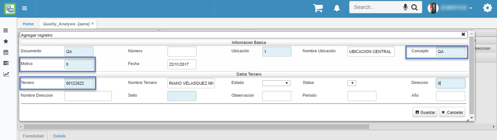

Al guardar el registro maestro, en la primera pestaña del detalle se cargará automáticamente el formulario dinámico parametrizado previamente en la aplicación [**BMOT - Motivos**](http://docs.oasiscom.com/Operacion/common/bsistema/bmot#parametrización-formularios-dinámicos-opción-aana---análisis-de-calidad).  

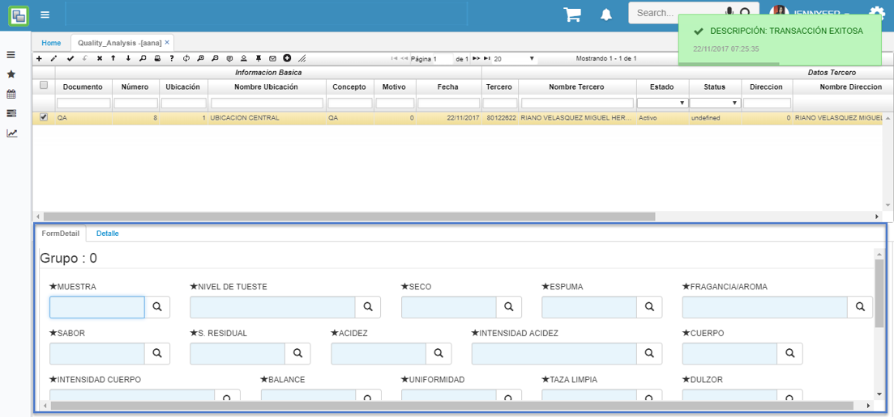

En esta pestaña, se deben diligenciar los campos mencionados para el análisis de calidad utilizando los zooms de ayuda. Cabe recordar que la información visualizada en estos zooms es la parametrizada en el detalle de la opción [**BCRC - Características**](http://docs.oasiscom.com/Operacion/common/bcomer/bcrc#parametrización-características---análisis-de-calidad).  

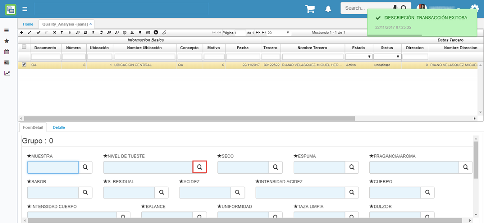

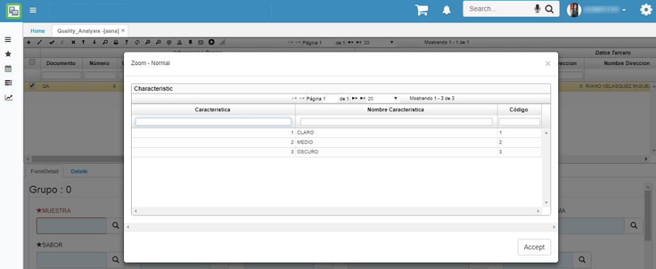

Diligenciando todos los campos:  

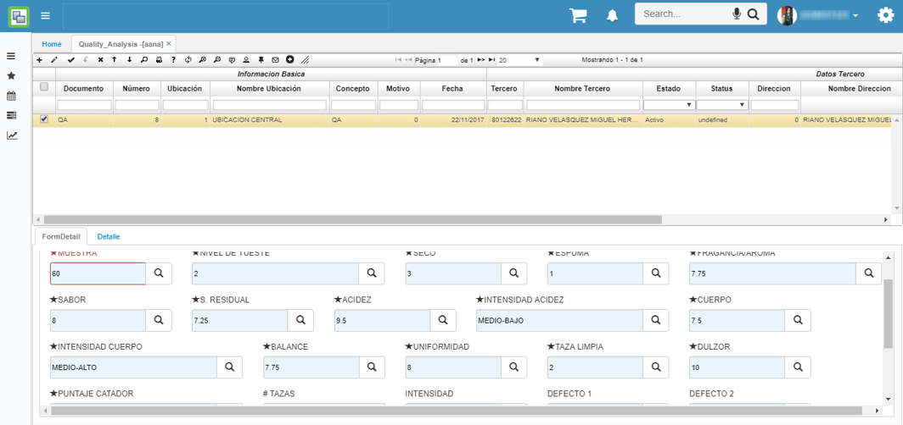

En el formulario dinámico, existe el botón _Agregar Grupo_ el cual permitirá adicionar un bloque nuevo de información en esta misma pestaña, para ingresar nuevos datos de una nueva muestra si así se requiere. Se diligencian los campos de la misma manera que el primer grupo.  

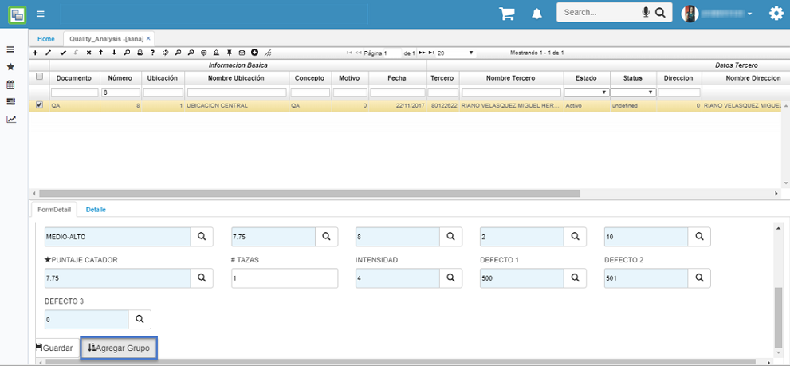

Al guardar la información y seleccionar la segunda pestaña, se insertará la calificación resultante según lo diligenciado en el formulario dinámico de la primera pestaña.  

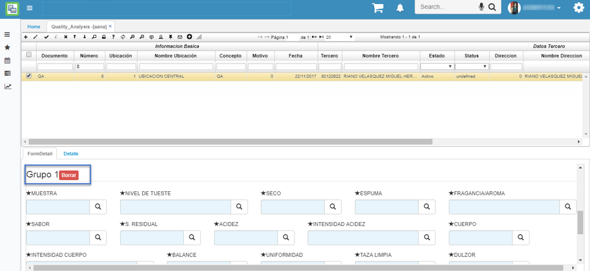

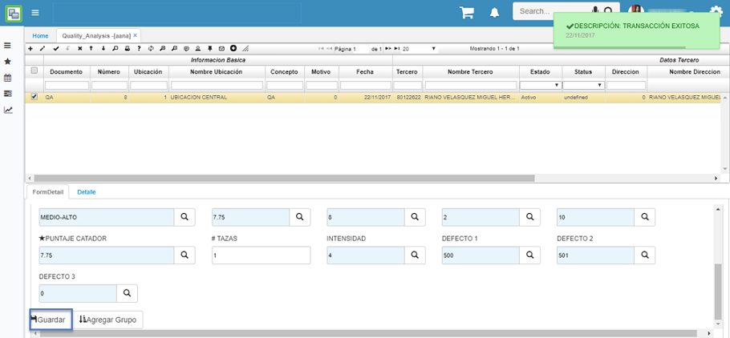

En este caso, se crearán dos grupos, uno por cada muestra (Control) ingresado, el cual puede visualizarse en el campo control.  

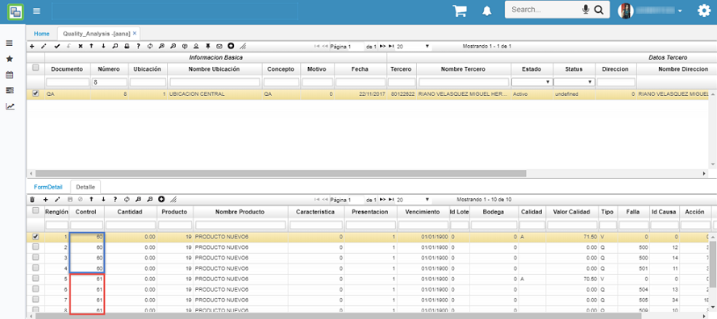

La cantidad de registros depende de la cantidad de defectos (fallas) ingresados a las posibles causas y acciones que se tengas por defectos.  

En el campo _Tipo_ cuando corresponde a **V**, hace referencia al valor de calidad y cantidad de cada producto y cuando es **Q**, contendrán los defectos (fallas) con sus respectivas causas y acciones según los defectos asociados en el formulario dinámico (primera pestaña del detalle).  

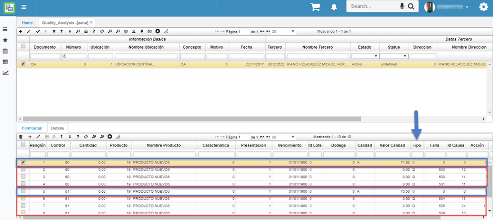

Finalizando este proceso, se confirma el registro.  

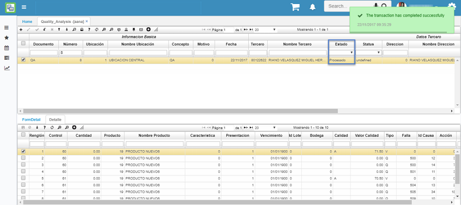

### [Vista Previa](http://docs.oasiscom.com/Operacion/utility/calidad/bregis/aana#vista-previa)

Permite la visualización de un informe de resultados del análisis de calidad con base a la información ingresada por el usuario en el detalle de dicha opción. Para generarla, se debe seleccionar el registro correspondiente y posteriormente el icono . Se generará el siguiente formato, el cual mostrará por hoja las observaciones de las causas y acciones con base a cada muestra.  

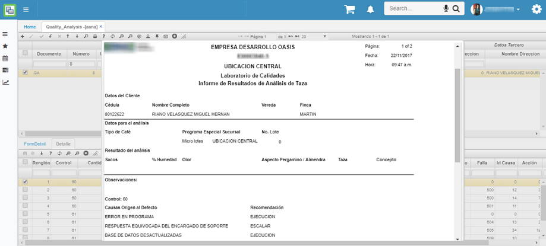
