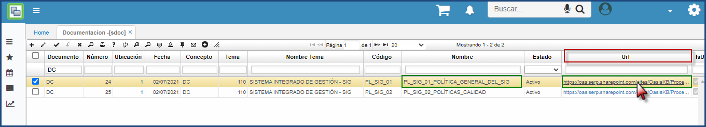

# DOCUMENTACIÓN - SDOC

La funcionalidad de la aplicación SDOC – Documentación es controlar la información de una empresa, siendo los sistemas de gestión una cultura basada en la calidad, el control de documentos desempeña un papel vital para impulsar el cumplimiento con las políticas organizacionales y otros procesos.
Dentro de la aplicación SDOC – Documentación permite crear un listado de documentos y realizar las respectivas consultas de este. 
En la siguiente imagen se observa la consulta de la ***PL_SIG_01_Política General del SIG*** por el tipo de documento **DC**, Numero **24**.

- **Documento**: DC
- **Numero**: ID del Documento.
- **Nombre de Tema**: Proceso o Area al cual pertenece el documento.
- **Código**: Codificación asignada al documento de acuerdo con las politicas de la empresa.
- **Nombre**: Nombre del documento asignado
- **Estado**: Estado del Documento.
- **URL**: Ubicación del documento dentro del repositorio ***Microsoft 365*** en el caso de OasisCom; para visualizar o descargar el documento es necesario dar clic sobre la URL.

Al dar clic se puede ver o descargar el documento consultado para este ejemplo es la ***PL_SIG_01_Política General del SIG***

Proporcionar un acceso fácil a todos los documentos asegurará que los miembros del equipo se mantengan informados y a tiempo.
