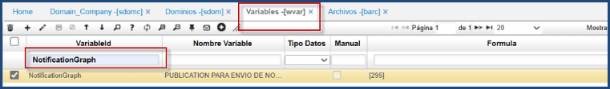
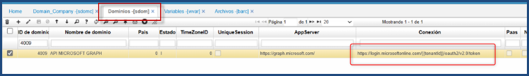
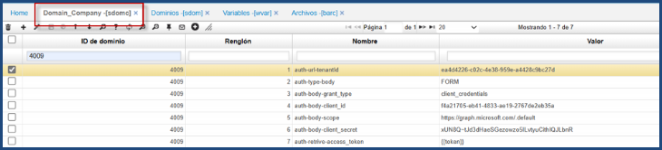
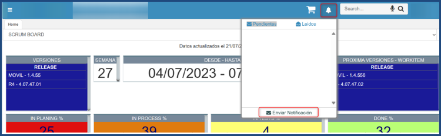
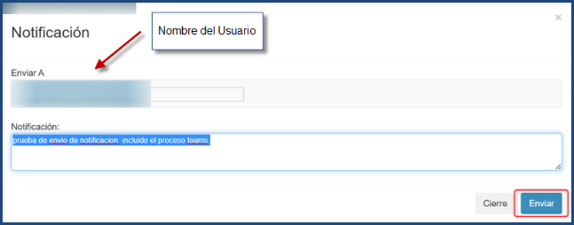

# Notificaciones

Las notificaciones son mensajes o alertas que se muestran al usuario para informarle sobre eventos relevantes o actualizaciones en tiempo real. Estas notificaciones se identifican en forma de icono en la aplicación. 

Su funcionalidad es: 
1. **Informar sobre nuevas actualizaciones:** Enviar notificaciones para informar a los usuarios sobre nuevas características, mejoras o cambios importantes en la aplicación.
2. **Notificar eventos importantes:** Alertar a los usuarios sobre eventos significativos relacionados con la aplicación, como recibir un mensaje importante, una actualización en un proceso, asignación de tareas, etc.
3. **Interacción en tiempo real:** Como chats o colaboración en tiempo real, las notificaciones pueden utilizarse para mostrar nuevos mensajes o actualizaciones en tiempo real.

Las notificaciones se realizan solo para los usuarios activos desde el icono de la “campana” se puede hacer el envío de notificaciones, visualización de notificaciones pendientes y leídas.

**Enviar Notificación**

**Notificaciones Pendientes**

**Notificaciones Leídas**

**Notificaciones Teams**

Para la configuración del envío de mensajes por Teams mediante la aplicación de OASISCOM.

* Paso 1: Debe ingresar a [**WVAR - Variables**](https://docs.oasiscom.com/Operacion/dss/bsc/wbasica/wvar), se configura como publicación que procede a generar la estructura graph.
 
    
    
* Paso 2: Diríjase a [**SDOM - Dominios**](https://docs.oasiscom.com/Operacion/cloud/sbasic/sdom), se realiza la configuración de la URL para obtener el token graph.

    

* Paso 3: Ingrese a **SDOMC - Domain_Company**, por configuración de credenciales para obtener token graph.

    

    - La aplicación [**BARC - Archivos**](https://docs.oasiscom.com/Operacion/utility/barchi/barc), se crea el archivo.
    - En [**BPUB - Publicaciones**](https://docs.oasiscom.com/Operacion/utility/barchi/bpub), se crea la publicación para asociar al archivo.
    - En [**SROL - ROLES**](https://docs.oasiscom.com/Operacion/system/sacceso/srol), se asignan los accesos a las publicaciones.

* Paso 4: Dar click en el botón de las notificaciones y *Enviar Notificación*.

    

* Paso 5: Ingresar el usuario al que se quiere realizar el envío de la notificación se redacta el mensaje que se desee y se procede a enviar.

    

