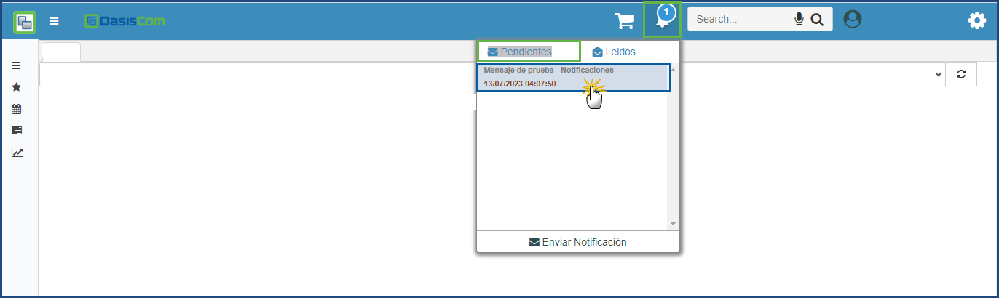

# Notificaciones

Las notificaciones son mensajes o alertas que se muestran al usuario para informarle sobre eventos relevantes o actualizaciones en tiempo real. Estas notificaciones se identifican en forma de iconos en la aplicación
Su funcionalidad es: 
1. **Informar sobre nuevas actualizaciones:** Enviar notificaciones para informar a los usuarios sobre nuevas características, mejoras o cambios importantes en la aplicación.
2. **Notificar eventos importantes:** Alertar a los usuarios sobre eventos significativos relacionados con la aplicación, como recibir un mensaje importante, una actualización en un proceso, asignación de tareas, etc.
3. **Interacción en tiempo real:** Como chats o colaboración en tiempo real, las notificaciones pueden utilizarse para mostrar nuevos mensajes o actualizaciones en tiempo real.

Las notificaciones se realizan solo para los usuarios activos desde el icono de la “campana” se puede hacer el envío de notificaciones, visualización de notificaciones pendientes y leídas.

**Enviar Notificación**

**Notificaciones Pendientes**

**Notificaciones Leídas**

