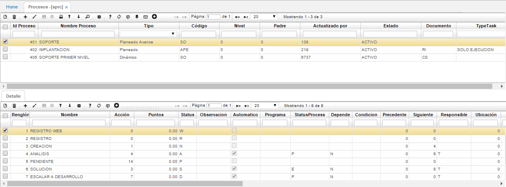

## Procesos - SPRC

En esta aplicación se realiza la parametrización de todos los procesos que se requieran.

### Flujo de trabajo de tareas

Se pueden obtener tres esquemas de flujo de trabajo de tareas, los cuales son:

- Planeado: En este esquema se realiza la planeación de las diferentes actividades que se requieran, se procesan y posteriormente se realiza la ejecución  
- Dinámico: En este esquema unicamente se realiza la ejecución a las actividades registradas  
- Planeado avance: En este esquema se realiza la planeación de las diferentes actividades que se requieran con su respectiva ejecución, este esquema se diferencia con el primero "planeado" dado que tiene configurado correos de respuesta por cada actividad planeada o ejecutada  

En el maestro, se realiza la parametrización del proceso que se requiere de la siguiente manera:

**Id Proceso:** Id del proceso, es un campo único para cada registro.  
**Nombre del proceso:** Nombre definido para el proceso que se está creando.  
**Tipo:** Aquí se selecciona el esquema que se requiere y que fue anteriormente nombrado: Planeado, dinámico o planeado avance.  
**Código:** Código informativo que se requiera definir para este proceso.  
**Actualizado por:** Número del usuario que ha modificado el regsitro, este campo se diligencia automáticamente.  
**Estado:** Estado del proceso, puede ser activo o inactivo.  
**Documento:** Documento asignado a este proceso. Este documento puede estar asociado a diferentes aplicaciones del sistema OasisCom, por ejemplo en este caso tenemos el documento RI asociado al proceso de implantación, esto quiere decir que cuando se genere el maestro del documento RI el sistema generará automáticamente el detalle de acuerdo a las actividades que se encuentran aquí parametrizadas.  

En el detalle, se realiza la parametrización asociada al proceso de la siguiente manera:

**Renglón:** Consecutivo que arroja el sistema, este consecutivo es único para que cada registro, es decir, no se puede repetir.  
**Nombre:** Nombre de la actividad definida para este proceso.  
**Status:** En este campo se debe asignar una letra única para poder identificar en que status se encuentra el documento, esta letra no se puede repetir en ninguno de los procesos a menos que la actividad tenga el mismo el nombre.  

Para realizar una mejor explicación de los diferentes esquemas que se tienen, vamos a mostrar un ejemplo para cada uno de los mismos:

- Planeado: Ingresamos a la aplicación [**Requerimientos - AREQ**] para poder visualizar el esquema  
- Dinámico: Ingresamos a la aplicación para poder visualizar el esquema  
- Planeado avance: Ingresamos a la aplicación [**Casos - ACAS**] para poder visualizar el esquema  
