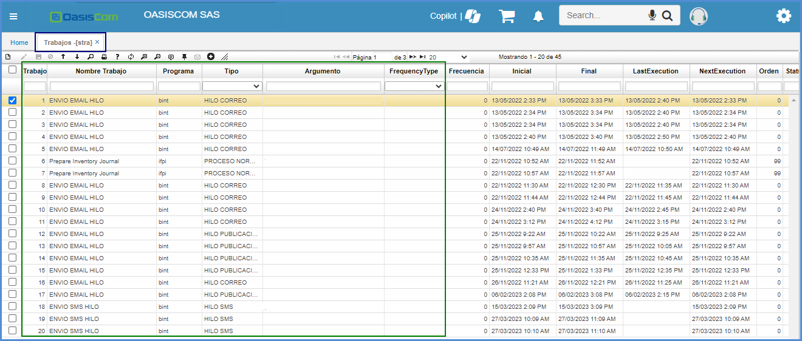

# STRA - TRABAJOS

El programa **STRA - Trabajos** es para realizar  configuraciones que se pueden realizar el proceso que se requiere.

Esto quiere decir que el programa **STRA - TRABAJOS** es para realizar parametrizaciones a los demas programas complementarios, con el fin de que cumplan una funcionalidad especifica. 

Para esta validación, ingresamos a la aplicación **STRA - TRABAJOS** 

 

**Campos a tener en cuenta**

| Campo | Descripción |
| --- | ----------- |
| Trabajo |  Es el número consecutivo que lanza el sistema automaticamente.|
| Nombre Trabajo | Se asigna el nombre el cual se le llamara al proceso que va a realizar en ese dicho movimiento que se requiere en la aplicación parametrizada. |
| Programa| Es el nombre del programa seleccionado a ejecutar el trabajo.|
| Tipo| El tipo que se le quiere asignar a dicha funcionalidad, los cuales son acciones. Cuentan con 4 Tipos: Proceso Normal, Hilo Correo, Hilo Publicación e Hilo Multiproceso. Dependiendo de este tipo seleccionado, el sistema ajustara el proceso a ejecutar. como se va ejecutar el argumento para esa dicha aplicación. |
| Argumento| En argumento se asigna los mensajes que se quiere reflejar a través de la aplicación parametrizada. Esto se acomoda sobre como ira a ejecutar el argumento para esa dicha aplicación.  |
| FrecuencyType| Este campo es para asignar con que recurrencia quiere que se ejecute, los cuales estan: Minutos, Horas, Días y Meses|
| Agente| Esto esta parametrizado con dos tipos: Web o Base de datos. Los cuales son asignados dependiendo de como lo quieren manejar. Y así mismo elegido el tipo que requieren, este lo manejara conforme a ese método.|

 

