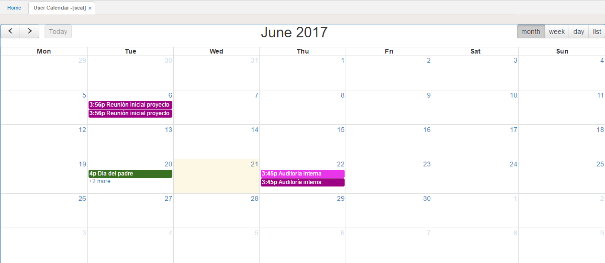
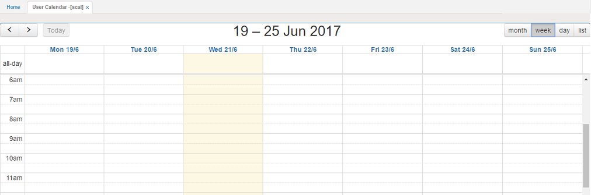
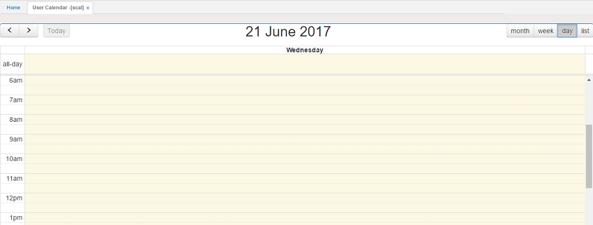
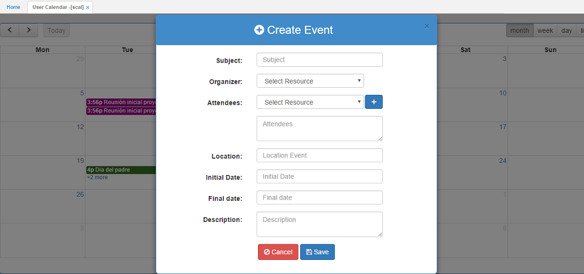
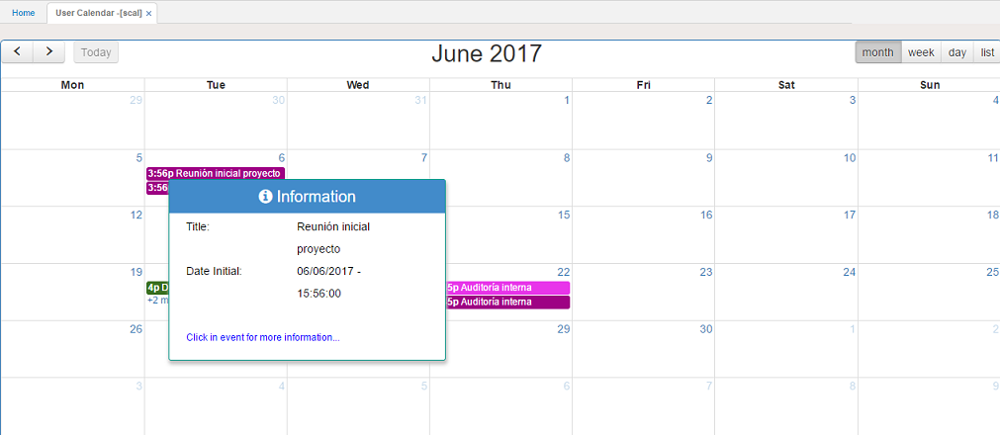
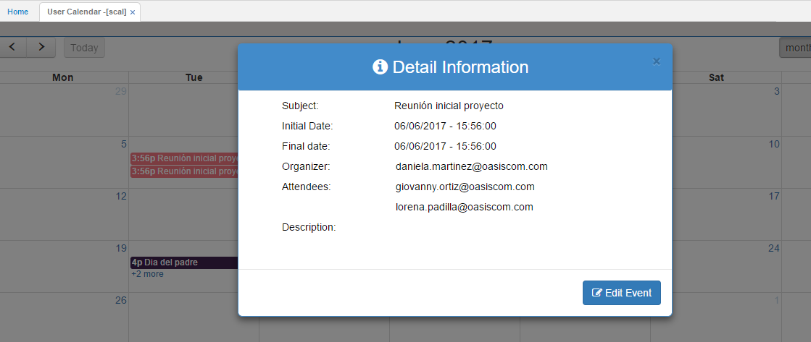

# SCAL - Calendario

Este calendario gráfico facilita la gestión de tareas, eventos, citas y/o reuniones de los usuarios vinculados a la aplicación de manera dinámica.  

La información puede ser visualizada en mes, semana o día.  

##### **_Mes_**

#### **_Semana_**

#### **_Día_**

### Creación de cita

Para crear una nueva cita, damos click sobre el día en que se vaya a realizar la reunión y diligenciamos el formulario.  

Diligenciado el formulario, damos click en el botón  y seguidamente se verá reflejada la nueva cita en el calentario.  

Para visualizar la información de la cita basta con poner el curso sobre el día o dar click sobre la misma para ver en detalle la información de la reunión.  

_Al poner el cursor en la cita_

_Al dar click sobre la cita_

