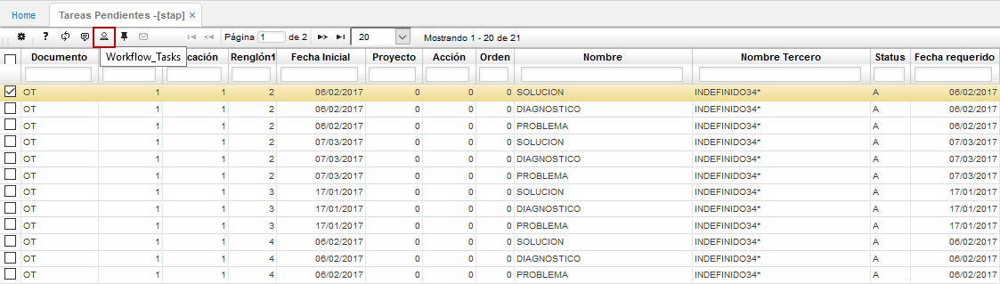
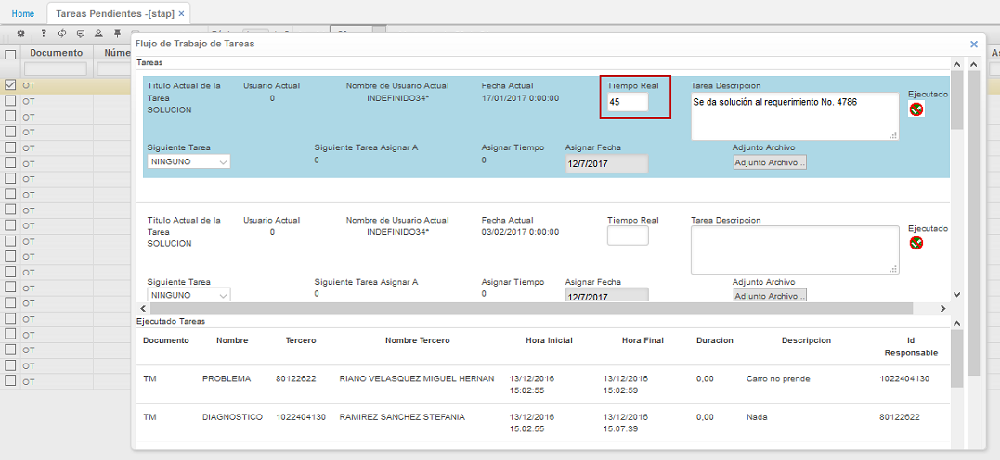
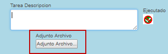

# STAP - Tareas Pendientes

La aplicación STAP permite visualizar las tareas pendientes de ejecución que tiene el usuario que se encuentra actualmente conectado en la aplicación, así como la ejecución de las mismas por medio de esta misma aplicación.  

La aplicación cuenta con la funcionalidad de _WorkFlow_ la cual permite ver las actividades asignadas al usuario registrado y poderlas ejercutar desde allí.  

Para ejecutar las tareas se debe inicialmente consultar en la aplicación, seleccionar alguna y dar click en el botón _WorkFlow_ .

Al dar click en dicho botón, el sistema arrojará una ventana como la siguiente, en donde se deberán diligenciar algunos campos, como lo es el _Tiempo Real_, el cual corresponde al tiempo que se gastó el usuario en realizar la tarea que se va a procesar, seguidamente, se debe hacer una descripción de la tarea realizada en el campo _Tarea Descripción_.

El workflow también da la opción de adjuntar algún archivo referente a la actividad ejecutada.  

Diligenciados los campos necesarios, damos click en el botón _Ejecutado_  