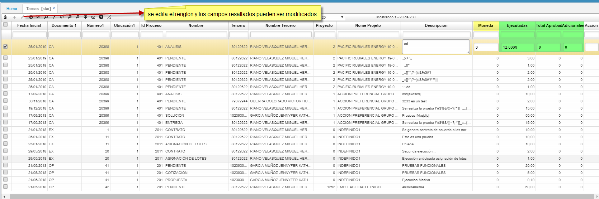
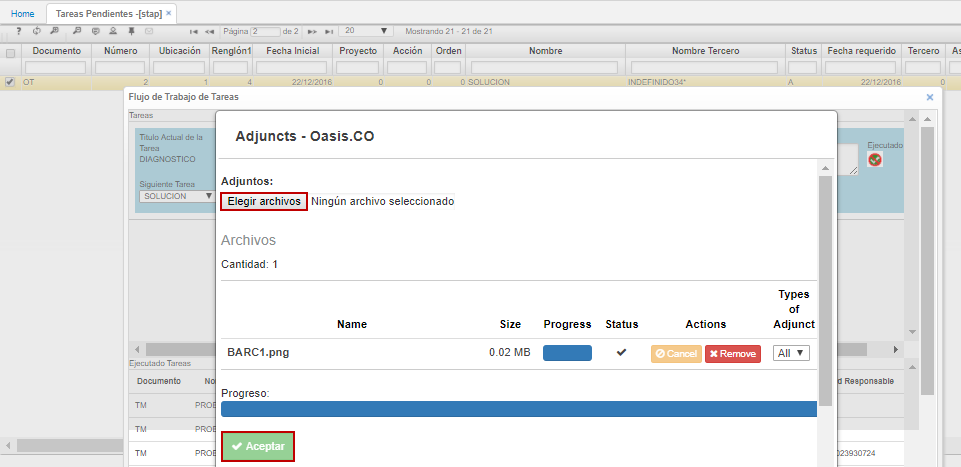
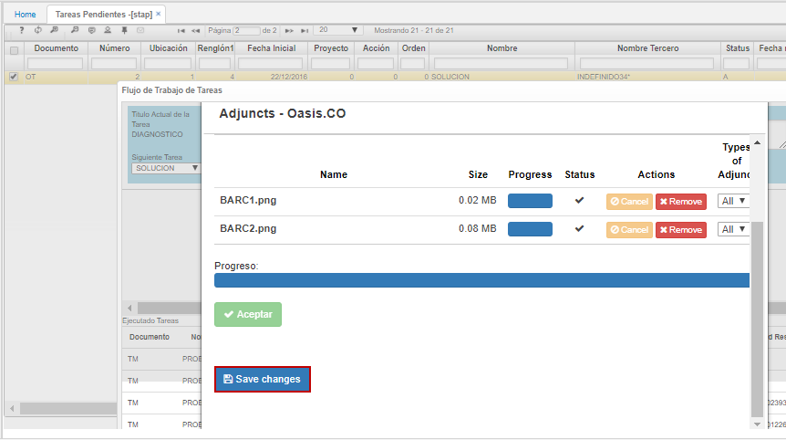
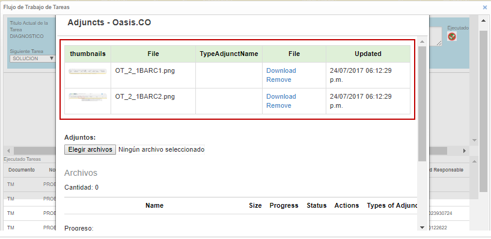

# STAR - Tareas  

Aplicación que permite editar o modificar las tareas ya registradas en WorkFlow. se utliza en los casos donde se hace necesario modificar cambios de tareas ya realizadas y ejecutadas desde el WorkFlow.  
La opción ** STAR**  solo modificara los valores de los campos: 
* 'DurationReal', 
* 'WorkTotal', 
* 'Advance'.
Según sea la moneda parametrizada en **BMON**, se podrá editar el campo: 
* CurrencyId.  

La aplicación NO cuenta con la funcionalidad de _WorkFlow_.  

Para ejecutar las tareas se debe inicialmente consultar en la aplicación **[STAP]**, seleccionar alguna y dar click en el botón _WorkFlow_ .

Al dar click en dicho botón, el sistema arrojará una ventana como la siguiente, en donde se deberán diligenciar algunos campos, como lo es el _Tiempo Real_, el cual corresponde al tiempo que se gastó el usuario en realizar la tarea que se va a procesar, seguidamente, se debe hacer una descripción de la tarea realizada en el campo _Tarea Descripción_.

El workflow también da la opción de adjuntar algún archivo referente a la actividad ejecutada, igualmente, permite visualizar dichos archivos de acuerdo al documento del registro sobre el cual se ejecutó la tarea. Es decir, si por ejemplo el documento corresponde a un _RE_, los archivos subidos pueden ser visualizados también desde el registro correspondiente en la aplicación **AREQ**.  

Para adjuntar un archivo damos click en el botón marcado a continuación.  

Aparecerá una ventana como la siguiente en donde se debe seleccionar el archivo que se desea cargar desde la ubicación local del equipo y seguidamente dar click en el botón  para que el archivo sea cargado. De ser necesario, se puede realizar este proceso las veces que sean necesarias para adjuntar todos los archivos correspondientes a la tarea que se ejecuta.  

Adjuntos todos los archivos correspondientes, damos click en el botón inferior  para que los archivos sean cargados correctamente.  

Al dar click, los archivos se verán de la siguiente manera y ya quedarán anexos a la ejecución de la tarea seleccionada.  

Finalmente, diligenciados los campos necesarios y adjuntos los archivos necesarios, damos click en el botón _Ejecutado_   