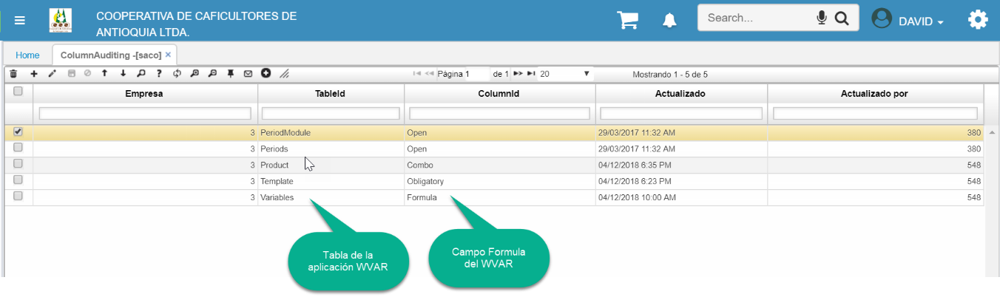
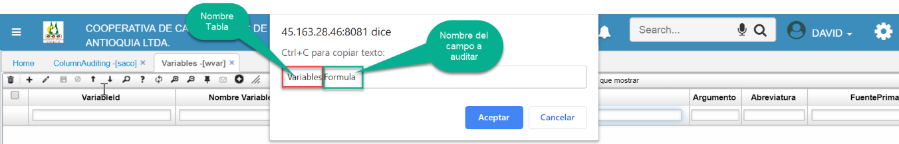
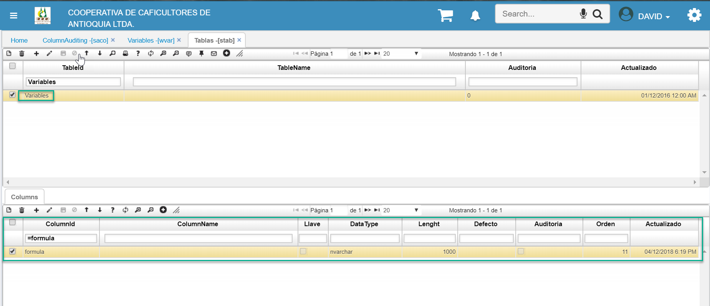
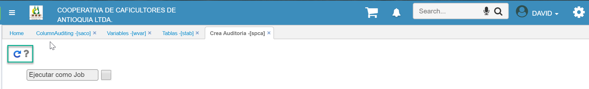
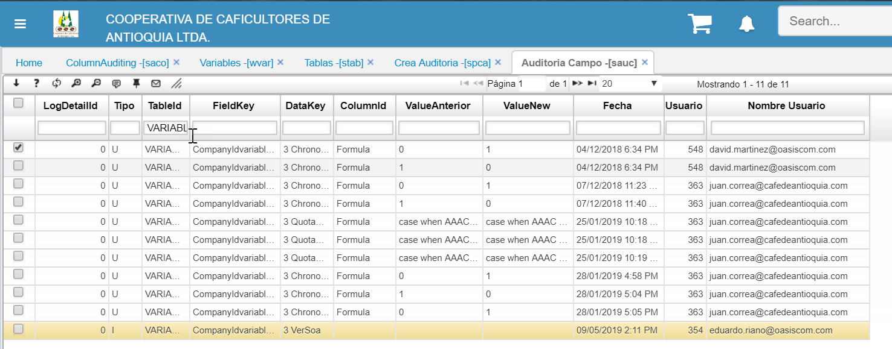
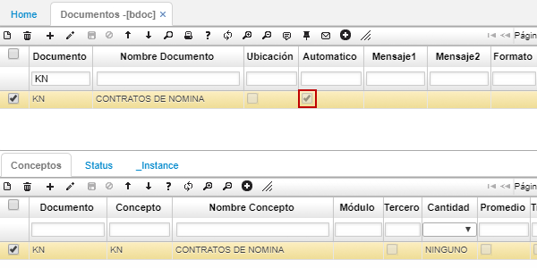

# AUDITORIA DE CAMPOS

Para auditar determinados campos de las aplicaciones de OasisCom se debe realizar la siguiente parametrización:  

1. **SACO** (Column Auditing): Aquí se deberá parametrizar el nombre de la tabla y el campo a auditar (Columna).  

  
Para saber tanto el nombre de la tabla como del campo en la opción correspondiente se podrá utilizar el comando Shift + F11 para identificarlo el cual mostrará un cuadro de dialogo mostrando esta información:  

  

2. **STAB** (Tablas): Se debe validar que tanto la tabla como los campos que se parametricen en el **SACO** se encuentren previamente creados en el STAB. El campo debe tener el mismo tipo de dato que se tiene configurado en la base de datos. Para el ejemplo se observa que el campo Formula se encuentra creado dentro de la tabla Variables del maestro del **STAB**:  

  

La mayoría de las tablas y campos de la base de datos se encuentran ya creados en el **STAB**, por lo que si la tabla o el campo no se encuentran parametrizados en esta aplicación y se tienen dudas sobre como parametrizarlo se deberá consultar con nuestro personal de servicio Posventa.  

3. **SPCA** (Crea Auditoria): Una vez se parametricen los campos que se desean auditar se deberá ejecutar este proceso el cual no pide parámetros de entrada, sólo se deberá ejecutar:  

  

Tener en cuenta que cada vez que se parametrice un nuevo campo en el **SACO** se deberá volver a ejecutar este proceso. Además, se debe validar realmente los campos que son totalmente necesarios a auditar, dado a que este proceso lo que hace es crear un Trigger sobre las tablas que se encuentren parametrizadas.   

4. **SAUC** (Auditoria Campo): Aquí se puede ver el resultado de la auditoria de campos. En el campo Tipo se puede ver si la operación fue de Inserción (I) o Actualización (U), el campo FieldKey muestra los campos que son llave Primaria de la tabla, el campo DataKey muestra los datos que son llave primaria, el campo ColumnId muestra el nombre del campo que fue auditado, el campo ValueAnterior muestra el dato anterior que tenía el campo antes de ser actualizado, el campo ValueNuevo muestra el dato nuevo por el que el campo fue actualizado y se muestra que usuario con el Id y el nombre fue quien modificó el campo:  

  

***********

