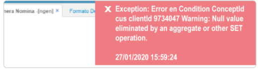

# Accesando concepto de nómina  

La inconsistencia es accesando el concepto de nómina.  

La solución es verificar en el [**NBTN - Tipos de nómina**](http://docs.oasiscom.com/Operacion/hrm/nomina/nbasica/nbtn) que exista el concepto y funciones, volver a generar la nómina por la opción [**NGEN - Genera nómina**](http://docs.oasiscom.com/Operacion/hrm/nomina/nnomina/ngen) 

