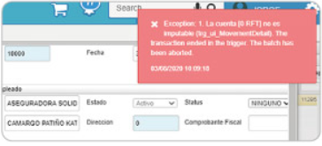
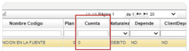

# Documento PMOV  

La inconsistencia es un error en un documento del PMOV.  

El error se debe a la parametrización del [**Plantillas - BPLA**](http://docs.oasiscom.com/Operacion/hrm/nomina/nbasica/nbtn) que en los códigos se encuentre la cuenta correspondiente.  

  

