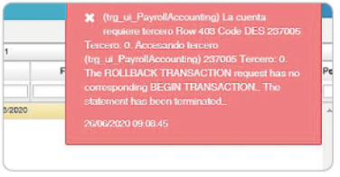

# Error al procesar la nómina en 1701. "La cuenta requiere tercero"  

La inconsistencia es error al procesar la nómina en 1701. "La cuenta requiere tercero".  

La solución es verificar la cuenta que nos indica el mensaje, en este caso, la cuenta 237005 y mirar en el [**Cuentas - BCUE**](http://docs.oasiscom.com/Operacion/common/bcuenta/bcue) que esté marcado el campo _**Tercero**; es posible que existan empleados sin entidades asociadas en la opción [**Empleados - NBEM**](http://docs.oasiscom.com/Operacion/hrm/nomina/nbasica/nbem).  

