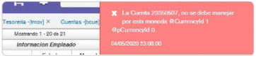

# Error en cuentas 

La inconsistencia es un error en las cuentas.  

  

La solución consiste en crear 2 documentos, uno para registrar los movimientos con moneda 0 y otro con moneda 1 en el cual deben indicar la TRM. La moneda la indican en el encabezado de los documentos.   

