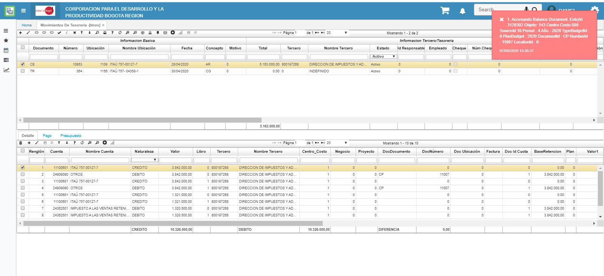

# Error al procesar Comprobante de Egreso  

La inconsistencia es error al procesar un Comprobante de Egreso.  

  

La solución es Desprocesar los CP que tienen creados con la cuenta que aparece en el mensaje, y prender el Flag de _**Presupuesto**_ en la aplicación [**Cuentas - BCUE**](http://docs.oasiscom.com/Operacion/common/bcuenta/bcue); posteriormente, se puede procesar el [**Movimientos - TMOV**](http://docs.oasiscom.com/Operacion/erp/tesoreria/tmovimient/tmov).   

