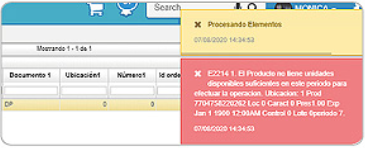

# Error en el documento DP  

La inconsistencia es un error al procesar documento DP.  

  

El error se puede presentar porque no existen unidades en el inventario, para ello se debe verificar en el [**Kárdex por Ubicación - ICKU**](http://docs.oasiscom.com/Operacion/scm/inventarios/icosto/icku), que tenga unidades disponibles el producto al que hace referencia al mensaje de control.

