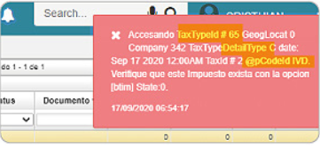

# No procesa factura de compra.

El error consiste en que no procesa la factura de compra.  

  

Para corregir la inconsistencia, se debe validar en el [Plantillas - BPLA](http://docs.oasiscom.com/Operacion/common/bcuenta/bpla) el cálculo del código **IVD**; en los documentos **FP** depende del tipo de impuesto del producto. Se verifica si este tipo de impuesto pertenece a la categoría de exclusión del IVA. Revisar si este debe ser el tipo de impuesto para el producto en el que cuenta con exclusión del código IVA..  
