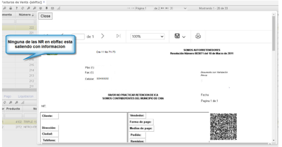

# Error en documentos del ODEQ  

Ningún documento del [**Documento equivalente - ODEQ**](http://docs.oasiscom.com/Operacion/ebportal/#aplicaci%C3%B3n-odeq-documento-equivalente), está saliendo con información al momento de previsualizar la factura.  

  

Como solución, se verifica para los documentos **NF** y **DV** que tengan la resolución en el [**Resoluciones - FRES**](http://docs.oasiscom.com/Operacion/scm/facturacion/fbasica/fres).

