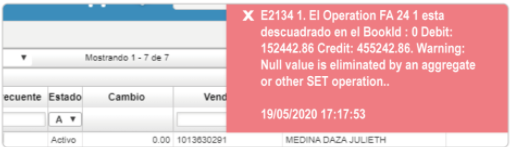

# JFAC/FFAC - Error al crear factura de venta.

La inconsistencia es un error al crear una factura de venta por diferencia en débito y crédito.  

  

Para corregir la inconsistencia, se debe eliminar el detalle del pago, dar clic en la pestaña detalle, volver a la pestaña de pago y procesar.
