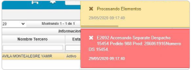

# Error al procesar ITRA

La inconsistencia es un error al procesar la aplicación [**Trabajos - ITRA**](http://docs.oasiscom.com/Operacion/scm/wms/wmmovimient/itra) 

  

Para corregir la inconsistencia, se debe revisar si en el campo _**Característica**_, se tiene un valor diferente al de la aplicación [**Pedidos - VPED**](http://docs.oasiscom.com/Operacion/scm/ventas/vpedido/vped). Es decir, se coloca en el **ITRA** la característica igual a la que se tenga en el **VPED**.
