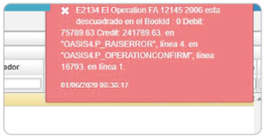
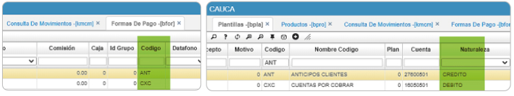

---

layout: default

title: Error al procesar facturas jfac

permalink: /Soporte/LogisticaSCM/erroralprocesarfacturasjfac

editable: si

---

# Error al procesar facturas por el JFAC  

* Una de las inconsistencias que se presenta es un error al momento de procesar una factura de venta por no existencia de producto.  

  

La solución consiste en verificar que haya existencia en el inventario  [**Kardex por Ubicación - ICKU**](http://docs.oasiscom.com/Operacion/scm/inventarios/icosto/icku) o  [**Kardex por Localicación - ICKL**](http://docs.oasiscom.com/Operacion/scm/inventarios/icosto/ickl) (con las especificaciones del producto, como lo es lote, vencimiento, entre otros)  

* Otra inconsistencia que se presenta es el siguiente mensaje de error al procesar la factura en el JFAC:  

  

La solución consiste en verificar si se creó una nueva forma de pago, si es así se debe verificar en el [**Formas de pago - BFOR**](http://docs.oasiscom.com/Operacion/common/bcomer/bfor) el campo _**Código**_ y también se debe verificar el [**Plantillas - BPLA**](http://docs.oasiscom.com/Operacion/common/bcuenta/bpla).  

