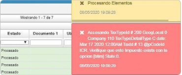

# Error al procesar por inconsistencia con el impuesto - btim  

La inconsistencia que se presenta es al momento de procesar una factura de compra por inconsistencia con el impuesto.  

  

La solución consiste en verificar el impuesto que indica el mensaje en el [**Tipos de Impuestos - BTIM**](http://docs.oasiscom.com/Operacion/common/bimpu/btim) que en el detalle, en el campo _**TIPO**_ esté la opción _**Compras**_, adicional, revisar el campo _**RENGLON**_, posterior a esto verificar el  [**Impuestos - BIMP**](http://docs.oasiscom.com/Operacion/common/bimpu/bimp) filtrando el impuesto indicado en el mensaje y en el detalle filtrar por el renglón que tiene en el BTIM, dar clic en la pestaña _**DETAILDETAIL**_ y verificar las fechas.  
