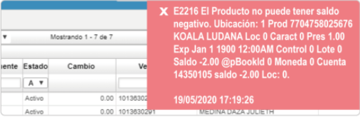

# Error al procesar por no existencia de producto  

La inconsistencia que se presenta es un error al momento de procesar una factura de venta por no existencia de producto.  

  

La solución consiste en verificar que haya existencia en el inventario  [**Kardex por Ubicación - ICKU**](http://docs.oasiscom.com/Operacion/scm/inventarios/icosto/icku) o  [**Kardex por Localicación - ICKL**](http://docs.oasiscom.com/Operacion/scm/inventarios/icosto/ickl) (con las especificaciones del producto, como lo es lote, vencimiento, entre otros)
