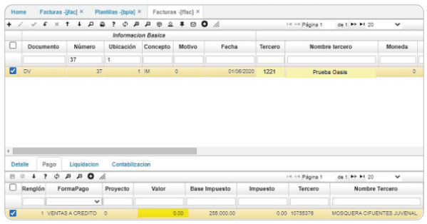

# Error campo valor pestaña pago FFAC.

La inconsistencia es un error en el campo valor de la pestaña pago en el FFAC al crear una factura de venta por diferencia en débito y crédito.  

  

Para corregir la inconsistencia, se verifica el  [**Plantillas - BPLA**](http://docs.oasiscom.com/Operacion/common/bcuenta/bpla) y se filtra por el documento que está generando inconsistencia, en este caso _**DV**_ x _**IM**_; para el código CxC, el campo _**detalle maestro**_ se encontraba con una **D** lo cual no es correcto, se modifica con la letra **P** que es lo correcto.