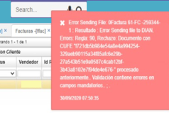

# Error con documento en FFAC  

+	Una de los errores que se pueden presentar con un documento en la aplicación FFAC es el siguiente:

  

Este mensaje de control se presenta dado que no se tiene asociado correctamente el tipo de impuesto.  Para solucionar el inconveniente, se debe mirar en el [Terceros](http://docs.oasiscom.com/Operacion/movil/bter) al tercero de la factura; este, debería tener un tipo de impuesto diferente al 0. Adicionalmente se recomienda revisar la parametrización del tipo de impuesto del producto.  

+	Otro error que se puede presentar con un documento en la aplicación FFAC es el siguiente:

  

Se evidencia que esta factura fue procesada con éxito; el mensaje que arroja es porque la factura ya había sido emitida a la DIAN. Al parecer la base tardó en procesar la factura y por ende salía este error.
