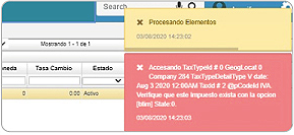

# Error con documento en FFAC

La inconsistencia es un error con un documento en la aplicación FFAC.

  

Este mensaje de control se presenta dado que no se tiene asociado correctamente el tipo de impuesto.  Para solucionar el inconveniente, se debe mirar en el [Terceros](http://docs.oasiscom.com/Operacion/movil/bter) al tercero de la factura; este, debería tener un tipo de impuesto diferente al 0. Adicionalmente se recomienda revisar la parametrización del tipo de impuesto del producto.
