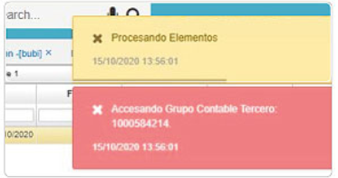

# No procesa liquidación de empleado  

La inconsistencia es que no procesa la liquidación de un empleado.  

  

El error que se presenta es porque el empleado no tiene asociadas entidades de afiliación en el [**Empleados - NBEM**](http://docs.oasiscom.com/Operacion/hrm/nomina/nbasica/nbem). Se deben asociar las entidades de afiliación y volver a generar la nómina para que tome las entidades en el detalle del [**Nómina - NNOM**](http://docs.oasiscom.com/Operacion/hrm/nomina/nnomina/nnom) y se pueda procesar sin errores.  

