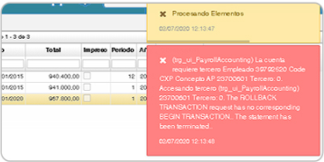

# Error al procesar documento AP  

La inconsistencia es un error al procesar el documento AP.  

  

La solución:  El error se puede presentar porque hace falta parametrizar el Nit de la entidad de riesgos en la empresa (semp) o parametrización de las entidades en el detalle del NBEM.  

