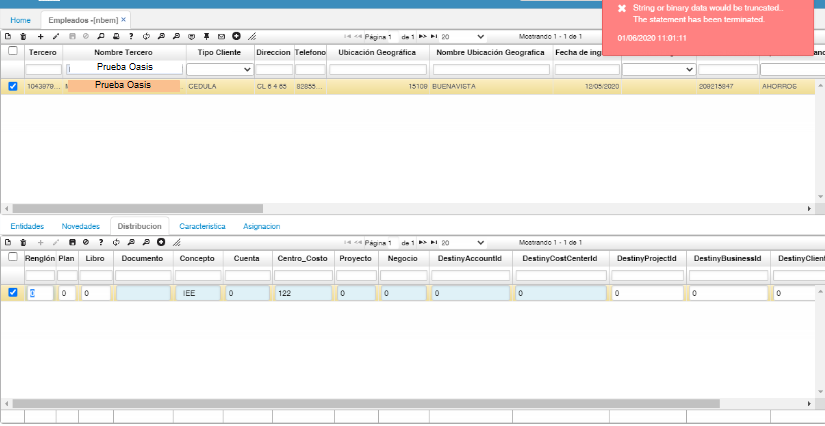

---

layout: default

title: NBEM Concepto iee

permalink: /Soporte/FinancieroFIN/nbemconceptoiee

editable: si

---

# No sale concepto IEE en el NBEM  

La inconsistencia es que se está realizando en el NBEM la distribución de los empleados administrativos y operativos, pero no está saliendo el concepto IEE.  

  

La solución:  Se evidencia que en el campo Concepto existen espacios al inicio del concepto IEE; posterior a esto, para el empleado del cual se está filtrando, se debe realizar el ajuste de la cuenta, centro de costo y porcentaje.   

