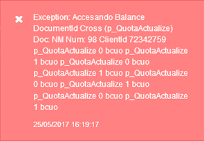
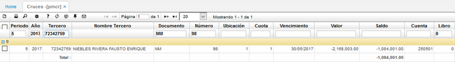
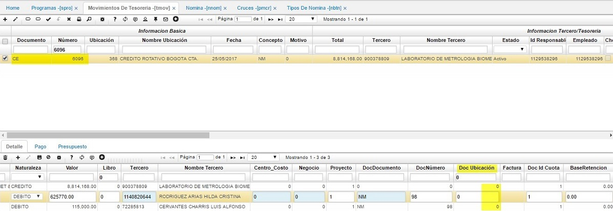

## Accesando Balance

### Movimientos de Tesorería (TMOV): Accesando Balance

Este mensaje de control indica que existe inconsistencias en los cruces de los documentos para el tercero que se muestra en el mensaje, para este caso se deben validar los datos en la aplicación de cruces del módulo cuentas por pagar [**PMCR - Cruces**](http://docs.oasiscom.com/Operacion/erp/cuentas/pmovimient/pmcr).

#### [**PMCR - Cruces**](http://docs.oasiscom.com/Operacion/erp/cuentas/pmovimient/pmcr)

Se hace el filtro por el documento que se muestra en el mensaje, con su respectivo periodo y año al que corresponde el documento que estamos intentando cruzar, documento, consecutivo y el tercero del documento origen, para este ejemplo filtramos: Periodo= 5, Año= 2017, Documento= NM, Número= 98 y Tercero= 72342759, allí el sistema me muestra toda la información del documento origen que se está intentando cruzar con el nuevo documento que se está realizando.  

Una vez validada la información del documento origen, se consulta el documento cruce, que en este caso corresponde a un movimiento de tesorería [**TMOV - Movimientos de Tesorería**](http://docs.oasiscom.com/Operacion/erp/tesoreria/tmovimient/tmov).

#### [**TMOV - Movimientos de Tesorería**](http://docs.oasiscom.com/Operacion/erp/tesoreria/tmovimient/tmov)

En el cual se debe validar la información que se requiere cruzar, para validar si hay algún dato que no coincide y esta es la razón por lo que el sistema genera el mensaje de control. Para el ejemplo consultaremos el comprobante de egreso _CE – 6096_.  

Al validar en el movimiento de tesorería, se debe validar que todos los datos como: tercero, documento, número, ubicación, cuota, cuenta, moneda, naturaleza (contraria al documento origen), etc., sean consistentes entre los dos documentos.  

Para el caso tomado como ejemplo vemos que la ubicación en la aplicación de cruces es la 1 y en el documento donde se está relacionando el documento origen tiene asignado el 0, como se muestra resaltado en la imagen anterior.  

Para evitar este tipo de diferencias el sistema ofrece un _Zoom_ de ayuda en el campo DocDocumento (cuadro de fondo azul) el cual, al dar doble clic sobre dicho campo, el sistema abre una ventana emergente con el(los) documento(s) que se pueden realizar el cruce y al escoger el documento origen correspondiente el sistema inserta automáticamente estos valores respecto al documento, si se digitan los datos de cruces manualmente, se puede generar el inconveniente que aquí se menciona, una vez seleccionado el cruce o corregida la información que no corresponda en el documento cruce, se puede seguir con el proceso para que el sistema haga la respectiva   afectación.
