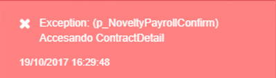
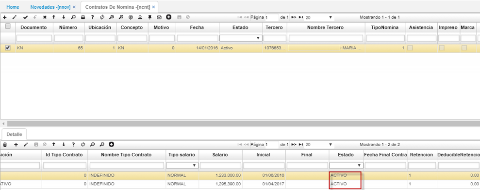
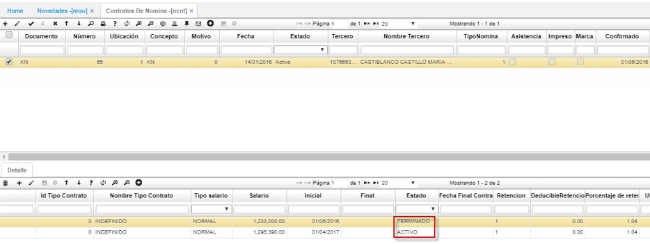
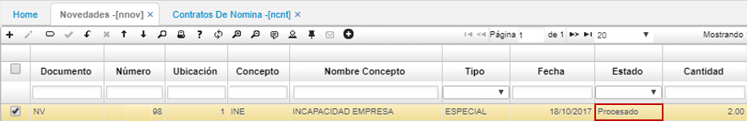

# Mensaje de control “Accesando ContractDetail” al procesar novedad en NNOV de OASISCOM

Cuando se realiza una novedad por cualquier concepto y al momento de procesar se presenta el siguiente mensaje:  

Este mensaje de control se presenta ya que el sistema encuentra que en el detalle del contrato para el empleado al cual se le realiza la novedad, más de 1 contrato en estado activo.  

Se debe validar en la aplicación [**NCNT - Contratos**](http://docs.oasiscom.com/Operacion/hrm/nomina/nbasica/ncnt) con el número de cédula del Tercero o bien con el número del contrato, que en el detalle del aplicativo independiente del número de registros o contratos que tenga, sólo debe haber 1 en estado activo, este es el vigente.  

Es importante tener en cuenta que al tener varios contratos en estado activo, al generar la nómina para ese tercero los datos y conceptos generados pueden salir erróneos, pues la generación, cálculo y liquidación de la Nómina depende de estos contratos.  

Una vez se haya cambiado el estado del contrato que no está en vigencia se pude procesar la novedad.  

