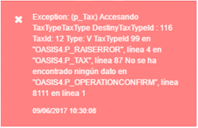
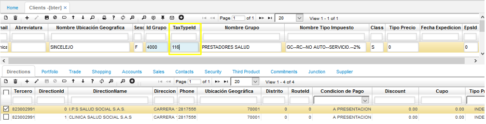
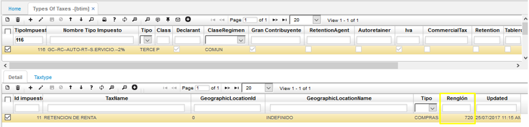

## Básico de Tipos de Impuestos (BTIM): Accesando Tipo de Impuesto Destino, no se ha encontrado ningún dato

Está incidencia se presenta porque no se tiene la parametrización del [**Básico de Tipos de Impuestos - BTIM**](http://docs.oasiscom.com/Operacion/common/bimpu/btim) de manera adecuada, para poder corregir está incidencia se debe validar el tipo de impuesto asignado al tercero que relaciona en la transacción a realizar y hacer la parametrización correspondiente, posteriormente se puede seguir con el proceso para confirmar la transacción.  

Primero se valida el tercero relacionado en la transacción, en la aplicación del [**Básico de Terceros - BTER**](http://docs.oasiscom.com/Operacion/common/btercer/bter), con el fin de determinar el tipo de impuesto que tiene parametrizado en el sistema.

Para el ejemplo que vamos a tomar consultamos el tercero y podemos ver que tiene asignado el tipo de impuesto 116 (el cual también corresponde al tipo de impuesto que muestra el sistema en el mensaje de control).  

Al consultar este código en la aplicación del Básico de Tipos de Impuestos (BTIM), en el detalle se deben tener relacionados cada uno de los impuestos que le aplican, los cuales deben estar previamente creados en el [**Básico de Impuestos - BIMP**](http://docs.oasiscom.com/Operacion/common/bimpu/bimp).  

Para el ejemplo que estamos tomando, vamos a parametrizar el impuesto de retención de renta 2%, para ello validamos el impuesto Retención de Renta (11), con el fin de determinar el renglón que corresponde al porcentaje que requerimos para este caso.  

Una vez validado el renglón podemos realizar la parametrización del tipo de impuesto, se debe insertar un nuevo registro en el detalle de la aplicación (parte inferior) y relacionar los impuestos, la ubicación si aplica, el tipo (Si es para Compras o Ventas) y el renglón que debe tomar de referencia para el impuesto, de acuerdo al porcentaje de cada uno de los registros.  

Puede haber casos en los que si se tienen registros en el detalle y aun así se presenta el mensaje de control, lo que indica que sólo hace falta la parametrización en el tipo de impuesto de la empresa, lo cual validaremos a continuación.  

Sobre la misma aplicación de tipos de impuestos, debemos consultar el tipo de impuesto de la empresa, el cual es el mismo en todas las instalaciones (99) y en el detalle relacionar los impuestos, el tipo (Compra o Ventas), el tipo de impuesto destino y se debe marcar si aplica o no (encendiendo el Check).  

Para el ejemplo se inserta un nuevo registro relacionando el tipo de impuesto que acabamos de parametrizar para que lo tome y nos permita procesar la transacción.  

Se realiza este mismo proceso para todos los impuestos que le aplican al tipo de impuesto que nos encontramos parametrizando.  

Finalmente, una vez realizado el proceso de parametrización, se puede continuar con el proceso para procesar la transacción que nos generaba el mensaje de control.

