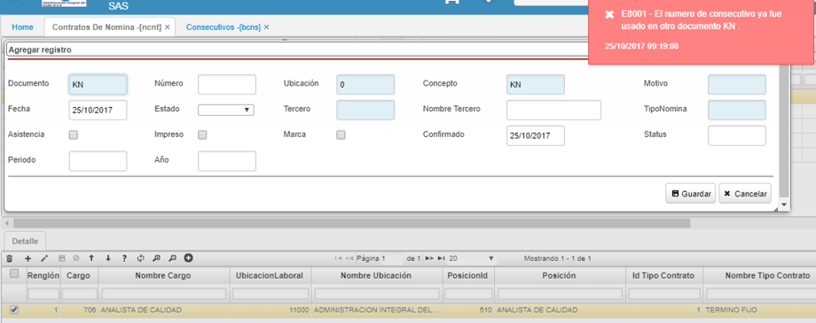
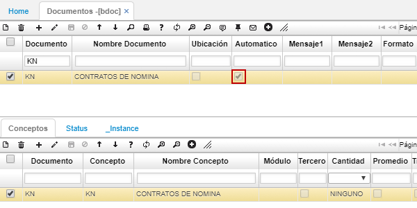

# Consecutivo

El mensaje _"El número de consecutivo ya fue usado en otro documento"_, se presenta porque en la aplicación [**BDOC - Documentos**](http://docs.oasiscom.com/Operacion/common/bsistema/bdoc) el documento relacionado que nos encontramos insertando, no contiene el check _**“automático”**_ activado, a continuación observamos un ejemplo en donde el sistema nos arroja un mensaje de control indicando que el número de consecutivo ingresado para el documento **KN** ya fue utilizado en otro documento.  

Por lo tanto, nos dirigimos a la aplicación [**BDOC - Documentos**](http://docs.oasiscom.com/Operacion/common/bsistema/bdoc) y buscamos nuestro documento, activamos el campo _**Automático**_ y procedemos a guardar, esto nos indica que el consecutivo del documento será automático o de lo contrario el sistema lo tomará como un consecutivo manual. Una vez realizado el proceso el sistema nos permite realizar la creación del documento sin inconsistencias.  

