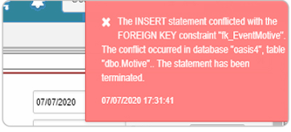

## Error en documento OM de AMEJ  

El error se presenta en el documento OM de la aplicación [**AMEJ - Mejoras**](http://docs.oasiscom.com/Operacion/utility/calidad/amejora/amej).  

  

Como solución, se debe revisar la parametrización del documento OM por el respectivo concepto en la aplicación [**BMOT - Motivos**](http://docs.oasiscom.com/Operacion/common/bsistema/bmot).  

