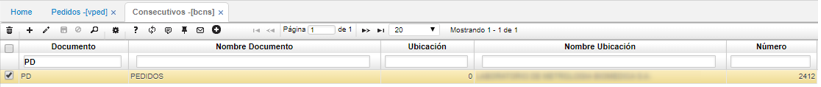
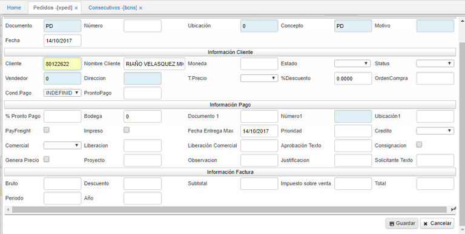
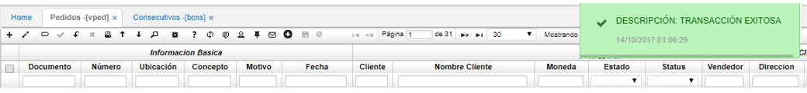
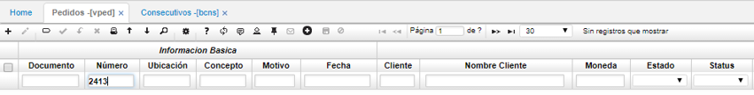
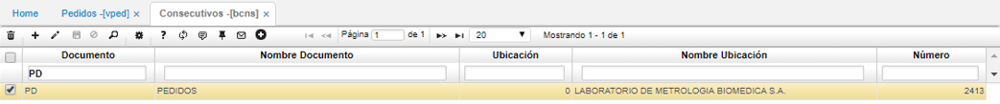
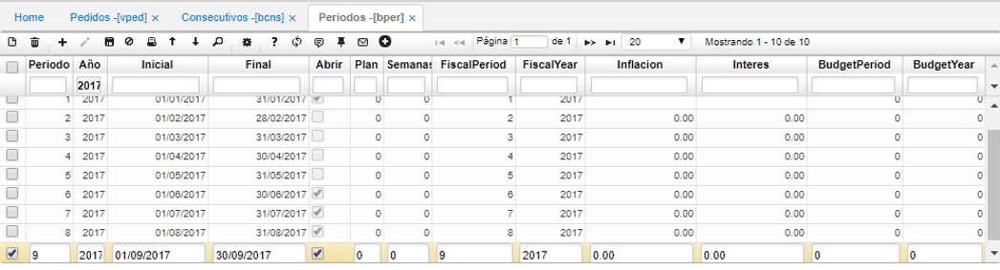
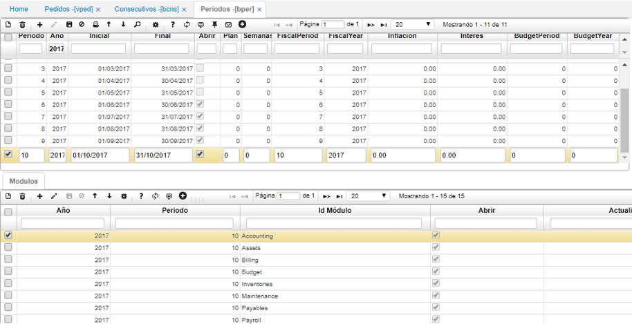
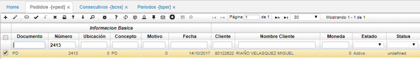

## Inconveniente en la visualización de documentos al no tener parametrizado correctamente BPER - Periodos  

Este inconveniente se manifiesta cuando se intentan crear o consultar documentos como lo son los pedidos o documentos de cruces en los zooms, esto ocurre ya que no se encuentra debidamente parametrizada la aplicación [**BPER - Periodos**](http://docs.oasiscom.com/Operacion/common/bsistema/bper) al periodo, mes, año o módulos necesarios en el sistema.  

En esta ocasión se va a realizar un ejemplo de cómo solucionar esta situación.  

- Módulo Pedido aplicación VPED  

Al crear un nuevo pedido en la ventana del maestro y guardar el registro, el registro no se visualiza, esto hace que al intentar repetir el proceso de creación de documentos y no lograr visualizarlo aumenten el número de documentos innecesarios:  

Para validar el consecutivo del aplicativo [**VPED - Pedidos**](http://docs.oasiscom.com/Operacion/scm/ventas/vpedido/vped) validamos en este caso la aplicación [**BCNS - Consecutivos**](http://docs.oasiscom.com/Operacion/common/bsistema/bcns).  

Se puede validar que el documento PD x PD lleva un consecutivo actual de 2412, el consecutivo que debe tener al momento de crear debe ser 2413.  

Se procede a crear el nuevo pedido PD X PD:  

Se diligencia el formulario de creación y al proceder a guardar el documento no aparece.  

Se intenta filtrar por el consecutivo que el sistema le asignó al nuevo documento y aún así no aparece en la aplicación.  

Se valida de nuevo la aplicación [**BCNS - Consecutivos**](http://docs.oasiscom.com/Operacion/common/bsistema/bcns), donde comprobamos que el documento si fue creado ya que se aumentó el consecutivo actual:  

Esto sucede ya que el sistema valida la fecha actual, periodo, año y módulos en la creación o consulta de movimientos y esto se realiza validando la aplicación [**BPER - Periodos**](http://docs.oasiscom.com/Operacion/common/bsistema/bper).  

Como se pudo observar el periodo 10 al cual es el que se está realizando la creación no está parametrizado en el sistema; se procede a crear el periodo y los módulos necesarios:  

Una vez realizado este proceso se vuelve a consultar el la aplicación [**VPED - Pedidos**](http://docs.oasiscom.com/Operacion/scm/ventas/vpedido/vped) por el documento PD 2413 y ya el sistema permite visualizarlo.  

Esto aplica para los documentos que no aparecen en un zoom para realizar un cruce, ya que los rangos de fecha se validan con el parametrizado en el periodo del [**BPER - Periodos**](http://docs.oasiscom.com/Operacion/common/bsistema/bper).  

