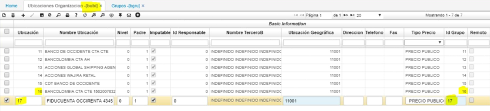
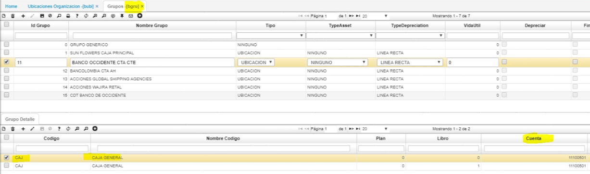
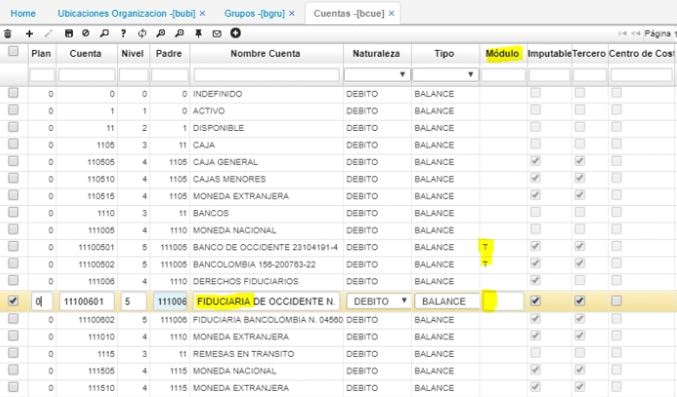

# BGRU - Asignación de cuentas

Mensaje al intentar procesar un documento de tesorería.  

El inconveniente se presenta por falta de parametrización.  

La parametrización que debe de realizar es la siguiente:  

La ubicación desde la cual se está intentando procesar el documento, tiene asignado un grupo de cuenta que no existe (aplicación [**BGRU - Grupos**](http://docs.oasiscom.com/Operacion/common/bcuenta/bgru)).  

Se debe crear el grupo de cuenta, o en su defecto si ya se encuentra creado, se debe colocar en el campo _Grupo_ el de la aplicación [**BUBI - Ubicaciones organización**](http://docs.oasiscom.com/Operacion/common/borgan/bubi).  

En caso de ser necesario crear el grupo de cuenta se debe colocar en el detalle el código de cuenta “CAJ” y asociarle la cuenta contable correspondiente a la ubicación desde la cual se está intentando crear el documento.  

La cuenta debe tener asociado el módulo de tesorería en la aplicación [**BCUE - Cuentas**](http://docs.oasiscom.com/Operacion/common/bcuenta/bcue).  

