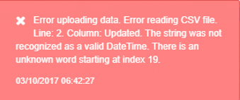
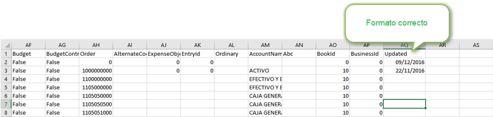
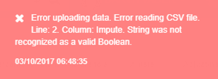
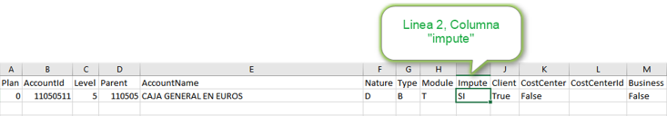
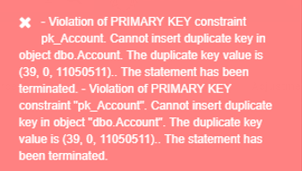

# Cargue de archivos al sistema OASISCOM

Al momento de subir un archivo plano al sistema, este nos puede arrojar mensajes de control que informan el origen de la inconsistencia.  

Este mensaje se presenta porque en la línea 2 del archivo, en la columna “UPDATED”, el formato de la fecha es incorrecto, lo más recomendable es dejar la columna en blanco, o en su defecto utilizar el formato de fecha dd/mm/aaaa.  

Este mensaje ocurre porque el archivo en la línea 2, Columna “impute”, se está intentando ingresar palabras como (SI – NO) cuando deben ser (True-False) respectivamente.  

Este mensaje aparece cuando intentamos ingresar información duplicada al sistema.  

