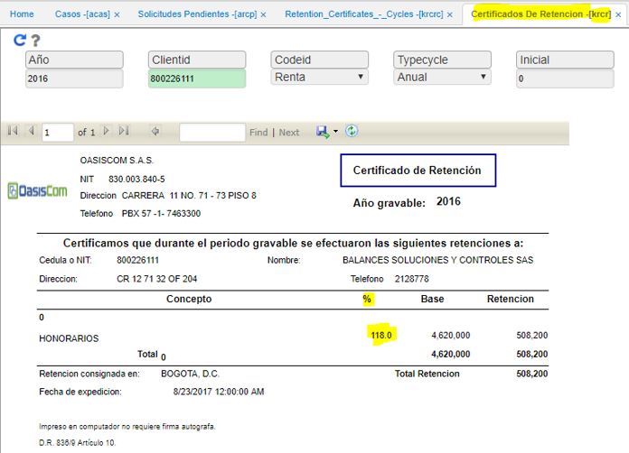
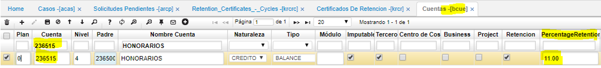
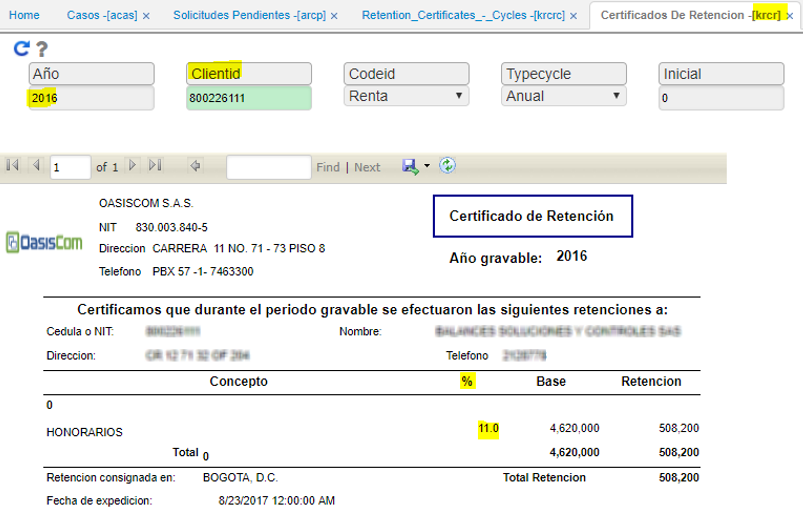

# Certificado de Retención (KRCR): Muestra Porcentaje Incorrecto

A continuación, indicamos la parametrización que se debe realizar para corregir cuando el porcentaje que se muestra en una o varias cuentas sobre el reporte Certificado de Retención, el cual se hace a través de la parametrización de las cuentas.  

Lo primero que se debe realizar es identificar la o las cuentas que están presentando el inconveniente de acuerdo a la información proporcionada por el [**Certificado de Retención - KRCR**](http://docs.oasiscom.com/Operacion/erp/contabilidad/kreporte/krcr):  

Posteriormente, se valida en el [**Básico de cuentas - BCUE**](http://docs.oasiscom.com/Operacion/common/bcuenta/bcue), las cuentas identificadas con el error en el porcentaje y en la columna PercentageRetention, se debe parametrizar el porcentaje correcto.  

Para el ejemplo que estamos trabajando la cuenta es 236515, en el campo correspondiente le asignamos 11 que corresponde al porcentaje de retención para la cuenta de Honorarios.  

Finalmente, una vez se tengan parametrizadas las cuentas con el porcentaje correspondiente, se debe generar nuevamente el [**Certificado de Retención - KRCR**](http://docs.oasiscom.com/Operacion/erp/contabilidad/kreporte/krcr).  

Para el ejemplo, lo generamos con el Año: 2016, Tercero: 800226111, Código: Renta, Ciclo: Anual, Inicial: 0 y Final: 0. Obteniendo el resultado esperado.  

