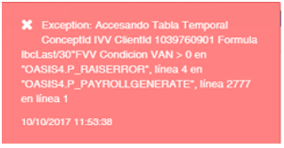
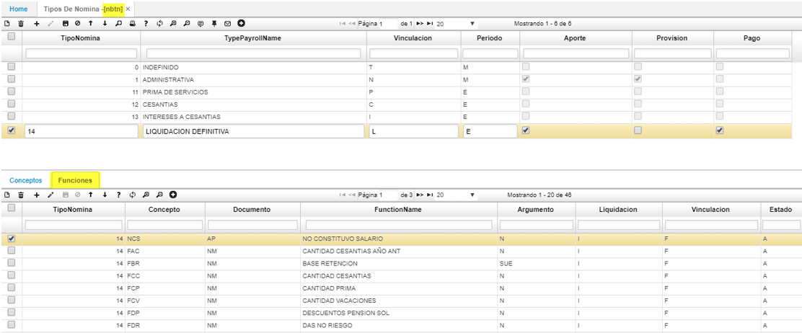

# Creación de concepto y funciones

Cada vez que se cree un concepto en la aplicación [**NBCO - Conceptos**](http://docs.oasiscom.com/Operacion/hrm/nomina/nbasica/nbco) o una función en [**NBFU - Funciones**](http://docs.oasiscom.com/Operacion/hrm/nomina/nbasica/nbfu) debe asociarse en el detalle de la opción [**NBTN - tipos de nómina**](http://docs.oasiscom.com/Operacion/hrm/nomina/nbasica/nbtn) en la pestaña “funciones” con el fin de que en la generación de la nómina no genere inconsistencias de tipo error _“Accesando tabla temporal concepto”_. Ejemplo (ver imagen1)  

Cuando se presente este error debemos dirigirnos a la aplicación [**NBTN - tipos de nómina**](http://docs.oasiscom.com/Operacion/hrm/nomina/nbasica/nbtn) y seleccionar la que nos encontremos ejecutando a través de la opción [**NGEN - Genera nómina**](http://docs.oasiscom.com/Operacion/hrm/nomina/nnomina/ngen) , adicionamos un nuevo registro en el detalle y asociamos nuestro concepto o función previamente creada , una vez realizada la respectiva parametrización volvemos a ejecutar la nómina.  

