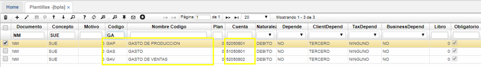
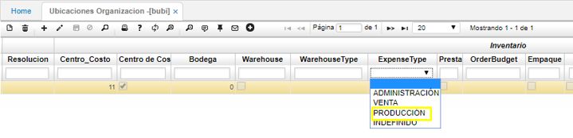
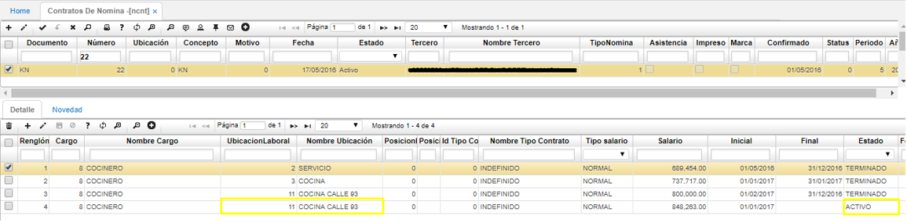
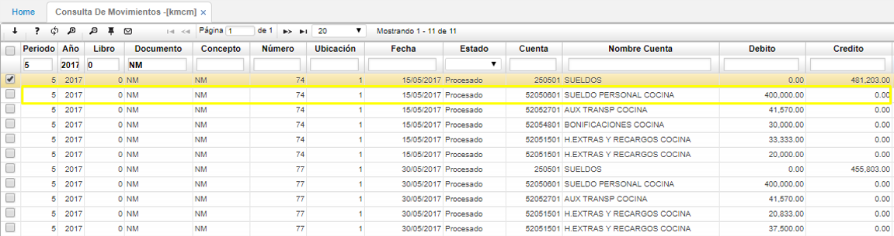

## Nómina (NNOM): Distribución por Tipo de Gasto

A continuación, indicamos la parametrización que se debe realizar para que el sistema pueda realizar la distribución de acuerdo al tipo de gasto (Administración, Ventas y Producción) en el módulo de nómina, el cual se hace a través del centro de costo que tenga asignado cada empleado.  

Lo primero que se debe realizar es la parametrización del [**Básico de Planillas - BPLA**](http://docs.oasiscom.com/Operacion/common/bcuenta/bpla) con cada una de las cuentas del gasto en los diferentes códigos que maneja el sistema así:  

* Gasto de Administración (GAS)
* Gasto de Ventas (GAV)
* Gasto de Producción (GAP)

  

Se debe tener en cuenta que esta parametrización se debe realizar por cada uno de los conceptos de nómina que debe distribuir el gasto (Sueldo, Bonificaciones, Comisiones, Horas Extras, Incapacidades, Licencias, etc.). Para el ejemplo se muestra la parametrización del concepto Sueldo (SUE).  

Posteriormente se valida en el [**Básico de ubicaciones - BUBI**](http://docs.oasiscom.com/Operacion/common/borgan/bubi) en los centros de costo que se tengan creados para tal fin, los cuales deben ser asignados a los empleados dependiendo de la ubicación laboral que cada uno de ellos tenga.  

Para el ejemplo que estamos trabajando el centro de costo es el 11 y lo vamos a parametrizar como centro de costo de producción, es decir que este centro de costo será asignado al personal de Producción.  

Finalmente, una vez se tengan parametrizados los conceptos básicos se debe asignar en los [**Contratos de nómina - NCNT**](http://docs.oasiscom.com/Operacion/hrm/nomina/nbasica/ncnt) de cada empleado el centro de costo correspondiente.  

Para el ejemplo, tomamos el contrato 22 y en el detalle (parte inferior) al registro que se encuentre Activo, el cual es el vigente para el empleado se debe asignar el centro de costo, en el campo de Ubicación laboral.  

Para poder validar la afectación contable, una vez se tenga la nómina procesada, pueden remitirse a la aplicación de [**Movimientos contables - KMCM**](http://docs.oasiscom.com/Operacion/erp/contabilidad/kmovimient/kmcm).  

Para nuestro ejemplo, vemos que el concepto de sueldo (SUE) fue aplicado correctamente en la cuenta parametrizada para el tipo de gasto de producción y el centro de costo 11.  

